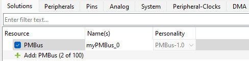
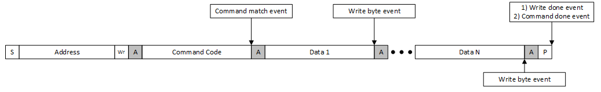
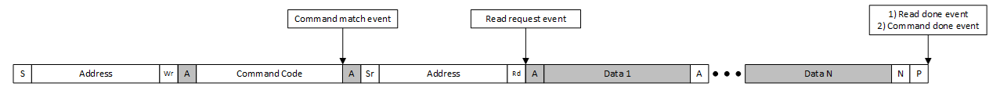
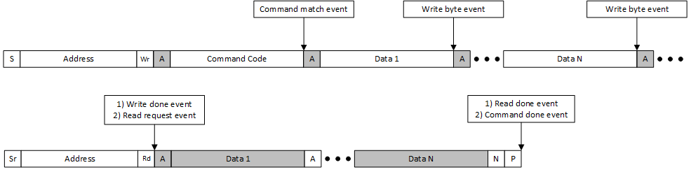
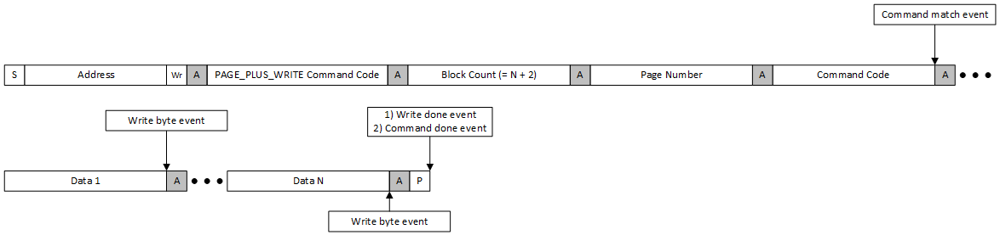
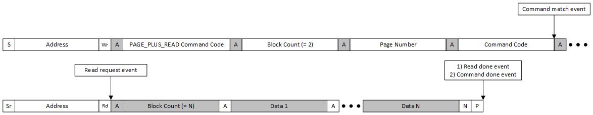
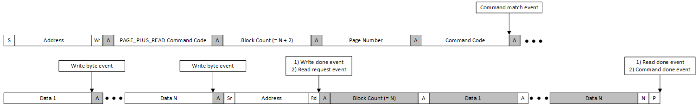
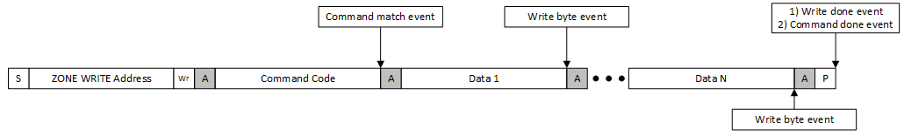
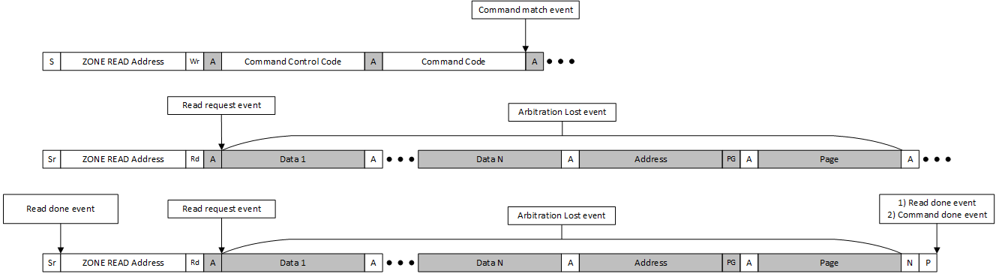
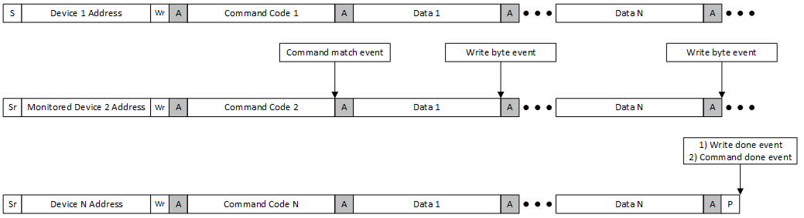

# PMBus Middleware Library

# Overview

The purpose of the PMBus middleware library is to provide a solution for implementing SMBus/PMBus target devices in embedded systems. PMBus (Power Management Bus) is an open standard digital power management protocol that enables communication with power conversion and management devices. Based on the SMBus protocol, PMBus extends its capabilities with a standardized command language designed specifically for power management applications.

The PMBus middleware provides a robust implementation that simplifies the development of PMBus-compliant devices, enabling users to focus on their specific application needs rather than the details of the communication protocol.

Use the PMBus middleware for:
* Power supply monitoring and control
* Power conversion device management
* Battery management systems
* Power distribution systems
* Any application requiring standardized power management communication

# Features

The PMBus middleware provides support for SMBus/PMBus communication:

**Target Mode features:**
- Built-in handling of pages and phases
- PEC (Packet Error Code) support
- SMBus protocols: Quick Command, Send Byte, Receive Byte,
  Write Byte/Word, Read Byte/Word, Process Call, Block Write/Read, Block Write-Read
  Process Call, SMBus Host Notify Protocol, Write 32/64, and Read 32/64
- Zone Read and Zone Write protocols
- Extended Command Protocol
- Group Command Protocol
- Multi-instance support
- Timeout detection mechanisms

**Controller Mode features:**
- APIs to execute SMBus protocols: Quick Command with WR direction, Send Byte, Receive Byte,
  Write Byte/Word, Read Byte/Word, Process Call, Block Write/Read, Block Write-Read
  Process Call, SMBus Host Notify Protocol, Write 32/64, Read 32/64
- API to execute generic SMBus/PMBus transactions
- PEC (Packet Error Code) support
- Multi-instance support
- Timeout detection mechanisms
- Host Mode with Host Notify Protocol support

# When to Use

Use the PMBus middleware when developing embedded applications that require:

* **Power supply monitoring and control** - Implement digital feedback loops, voltage/current monitoring, and fault management for DC-DC converters, AC-DC power supplies, and voltage regulators
* **Power conversion device management** - Configure and monitor point-of-load (POL) converters, multiphase controllers, and hot-swap controllers via standardized PMBus commands
* **Battery management systems** - Communicate with battery chargers, fuel gauges, and protection circuits using SMBus/PMBus protocols
* **Power distribution systems** - Build intelligent power distribution units (PDUs) with real-time telemetry, sequencing control, and fault detection
* **Server and datacenter power management** - Implement PMBus-compliant power shelves, rack power modules, and power supply units (PSUs)
* **Industrial automation** - Integrate digital power management into PLCs, motor drives, and industrial power systems

The middleware is ideal when you need standardized SMBus/PMBus protocol compliance with minimal development effort, whether implementing a target device that responds to controller commands or a controller that manages multiple power devices on the bus.

# Prerequisites

## Supported Devices

* PSOC&trade; Control C3 M7/M8/P7/P8
* PSOC&trade; Control C3 M3/M5/P2/P5
* PSOC&trade; Control C3 M6/P6

# Quick Start

This section provides step-by-step guides to quickly get started with the PMBus middleware for both Target and Controller modes.

## Target Mode Guides

- [Target Mode Quick Start Guide](guides/target_mode_quick_start.md) - Manual configuration approach
- [Target Mode Quick Start Guide (Using Solution Personality)](guides/target_mode_personality_quick_start.md) - Using Device Configurator
- [Verify Target Mode Workability](guides/verify_target_mode.md) - Testing and verification steps

## Controller Mode Guides

- [Controller Mode Quick Start Guide](guides/controller_mode_quick_start.md) - Manual configuration approach
- [Controller Mode Quick Start Guide (Using Solution Personality)](guides/controller_mode_personality_quick_start.md) - Using Device Configurator
- [Verify Controller Mode Workability](guides/verify_controller_mode.md) - Testing and verification steps

---

# Design Considerations

## Solution Configuration

The PMBus middleware has its own build into the Device Configurator specialized graphical user interface (GUI) that combines all middleware-related logical and physical layer settings in one place.

To create middleware instance configuration, add the PMBus instance on the Solutions tab in the Device Configurator.



Each PMBus instance includes the following configuration groups:
- **General** (provides the link to the PMBus middleware documentation)
- **External Tools** (allows to launch the PMBus Protocol Configurator tool)
- **I2C HW** (allows to configure the I2C hardware resources)
- **Timeout Detection** (allows to configure resources for the timeout detection feature)
- **PHY Extensions** (allows to customize the PMBus instance physical layer and make related configurations)

> **Note:** By default, the project uses the compile-time options generated by the Device Configurator and solution personality. For alternative manual configuration, refer to the mtb_pmbus_conf.h file description in [Add SMBus/PMBus code to your project](guides/target_mode_quick_start.md#3-add-smbuspmbus-code-to-your-project).

---

## Initialization Sequence

### Target Mode

First, initialize the hardware resources for the PMBus middleware without enabling it. The middleware determines when to enable the hardware resources. For this purpose, provide the following callbacks:
- `mtb_pmbus_stc_config_hw_t::hw_resource_ctrl_callback`
- `mtb_pmbus_stc_config_hw_t::enable_hw_irq_callback`
- `mtb_pmbus_stc_config_hw_t::disable_hw_irq_callback`

After the hardware resources are initialized, call the `mtb_pmbus_init` function. After initialization, you can update the default configuration of the middleware:
- Update the contents of the command buffer
- Disable and/or protect specific commands
- Update the default Zone Read/Write settings (required only in specific cases, typically the controller assigns the Zone Read/Write values)
- Select the active page/phase (required only in specific cases, typically the controller selects the active page/phase)

> **Note:** The `mtb_pmbus_init` function must be called before any other target APIs to initialize the instance structure. A call to the other APIs before the init function can lead to unexpected behavior including a hard fault error.

After completing the initial configuration, call the `mtb_pmbus_enable` function. After calling `mtb_pmbus_enable`, the middleware starts responding on the bus.

The contents of the `mtb_pmbus_stc_config_hw_t`, `mtb_pmbus_stc_config_t`, and `mtb_pmbus_stc_config_cmd_t` structures are not modified by the middleware, so they can be allocated in flash or RAM as needed. However, these structures must remain available for as long as the PMBus instance is active, and their contents are expected to remain unchanged after calling `mtb_pmbus_init`.

The contents of `mtb_pmbus_stc_t` are internal and not subject to modification by the application. The `mtb_pmbus_stc_t` structure is continuously updated by the middleware and therefore must be located in RAM.

`mtb_pmbus_enable` can only be called after `mtb_pmbus_init`.

The middleware does not provide a deinit function. To update the configuration, use the following sequence:
1. `mtb_pmbus_disable`
2. `mtb_pmbus_init`
3. `mtb_pmbus_enable`

The PMBus middleware does not deinitialize the target hardware resources. If the PMBus target instance is disabled and no longer required, the application is responsible for releasing the hardware resources.

### Controller Mode

The PMBus middleware manages the controller hardware-resource initialization through callbacks. The application does not initialize hardware resources manually before calling `mtb_pmbus_ctrl_init`. Instead, provide the following callbacks:
- `mtb_pmbus_ctrl_cfg_t::callback_hw` - for hardware initialization, enabling, and disabling
- `mtb_pmbus_ctrl_cfg_t::callback_isr_enable` - for enabling interrupts
- `mtb_pmbus_ctrl_cfg_t::callback_isr_disable` - for disabling interrupts

When `mtb_pmbus_ctrl_init` is called, it automatically invokes `mtb_pmbus_ctrl_cfg_t::callback_hw` with the MTB_PMBUS_CTRL_HW_RESOURCES_INIT event to initialize the hardware resources. The application will implement the hardware initialization code in this callback handler.

> **Note:** The `mtb_pmbus_ctrl_init` function must be called before any other controller APIs to initialize the instance structure. A call to the other APIs before the init function can lead to unexpected behavior including a hard fault error.

After completing the initial configuration, call the `mtb_pmbus_ctrl_enable` function. After calling `mtb_pmbus_ctrl_enable`, the controller is ready to initiate transfers on the bus.

The contents of the `mtb_pmbus_ctrl_cfg_t` and `mtb_pmbus_ctrl_stc_config_hal_t` structures are not modified by the middleware, so they can be allocated in flash or RAM as needed. However, these structures must remain available for as long as the PMBus controller instance is active, and their contents are expected to remain unchanged after calling `mtb_pmbus_ctrl_init`.

The contents of `mtb_pmbus_ctrl_stc_t` are internal and not subject to modification by the application. The `mtb_pmbus_ctrl_stc_t` structure is continuously updated by the middleware and therefore must be located in RAM.

`mtb_pmbus_ctrl_enable` can only be called after `mtb_pmbus_ctrl_init`.

The middleware does not provide a deinit function. To update the configuration, use the following sequence:
1. `mtb_pmbus_ctrl_disable`
2. `mtb_pmbus_ctrl_init`
3. `mtb_pmbus_ctrl_enable`

The PMBus middleware does not deinitialize the controller hardware resources. If the PMBus controller instance is disabled and no longer required, the application is responsible for releasing the hardware resources.

---

## Communication Protocols

The PMBus middleware supports multiple protocols defined in the SMBus and PMBus specifications. This section provides the specifics of the implementation for both Target and Controller modes.

### Target Mode

**Quick Command vs Received Byte Protocols:**

The Quick Command with the Read direction bit and the Received Byte protocol are identical during the Address stage of the transfer. As a result, the target device cannot distinguish between them in time, which may lead to an error condition on the bus.

> **Note:** After the last SCL clock for the ACK/NACK bit of the address part, the target starts to set the first bit of the Received Byte protocol. At the same time, if a Quick Command is initiated, the controller sets the SDA line to a low level to generate the STOP condition. Then, after setting the SCL line to a high level, the following cases can occur on the bus:
> - If the first bit of the Received Byte is 1, the controller wins arbitration and completes the transfer with a STOP condition. From the target's point of view, such a sequence of events on the bus is considered as arbitration lost.
> - If the first bit of the Received Byte is 0, the target continues holding the SDA line, which prevents the STOP event generation, and most likely a timeout error will be generated after 25 ms.

As a result, you can use Quick Command and Received Byte as follows:
- If only one protocol, either Quick Command or Received Byte, is used, no collision/errors occur on the bus.

> **Note:** If the Quick Command is initiated by the controller and the Received Byte is disabled in the middleware, the middleware sends the 0xFF byte after the address part of the transfer and ignores the arbitration lost event. Sending 0xFF allows the controller to win arbitration.

- No issue if only Quick Command with the Write direction and Received Byte are used.
- If both Quick Command with Read direction and Received Byte are used, the first bit of the Received Byte must always be set to 1 to allow the controller to win arbitration in the case of Quick Command.

> **Note:** For this case, the arbitration lost event is also ignored and the middleware does not report it to the application level.

**Zone Read and Write Protocols:**

The Middleware handles the Zone Read and Zone Write protocols, assigning new zones to the pages and tracking the new active zones on the bus automatically. Also, the Middleware cares about Command Control code and determines the type of actions (Status or Command), the byte ordering, bit swapping and respond mode. So, the commands handling is very similar to standard protocols. Also, to read/write command data, the Zone Read protocol can be used to request the status. The Middleware reports the requested status bits through in callback to application, see `mtb_pmbus_zone_events_t`.

To enable Zone protocols execute the next steps:
- Enable Zone protocols in Compile Time Options by setting `MTB_PMBUS_SUPPORT_ZONE` to 1U
- Enable Zone in config structure by setting `mtb_pmbus_stc_config_t::enable_zone` to true
- Enable Zone Config and Zone Active commands in Compile Time Options using `MTB_PMBUS_IMPL_CMD_ZONE_CONFIG` and `MTB_PMBUS_IMPL_CMD_ZONE_ACTIVE`
- Enable Zone Config and Zone Active commands in config structure using `MTB_PMBUS_IMPL_CMD_ZONE_CONFIG_EN` and `MTB_PMBUS_IMPL_CMD_ZONE_ACTIVE_EN` masks in `mtb_pmbus_stc_config_t::impl_cmd_mask` field
- Add Zone specific callback `mtb_pmbus_stc_config_t::zone_callback` in case if status should be handled

**Zone Write and Zone Read command handling:**

From User point of view, the commands handling during the Zone protocols is almost the same as for standard protocols. The only difference is that during Zone Read protocol, the lost arbitration event may occur when the Middleware loses arbitration to another target. To ensure that Controller completes the read of the command, always check if `MTB_PMBUS_CMD_DONE` event has occurred.

By default, after initialization of PMBus instance, the 0xFE zone is assigned for all pages. It is expected that the proper zone values are assigned by Controller or manually use the `mtb_pmbus_set_default_zones` function.

Zone protocols rely on the pages, but if pages are disabled for PMBus instance, the Zone Write and Zone Read are assigned globally for the whole instance.

### Controller Mode

The Controller mode provides dedicated API functions to execute standard SMBus protocols. The middleware handles protocol-specific details such as command code, byte counts, payload formatting, PEC calculation, and proper bus sequencing.

**Supported SMBus/PMBus Protocols:**

<table style="border: 1px solid black; border-collapse: collapse;">
<tr>
<th style="border: 1px solid black; padding: 8px;">Protocol Name</th>
<th style="border: 1px solid black; padding: 8px;">API Function</th>
</tr>
<tr>
<td style="border: 1px solid black; padding: 8px;">Quick Command (Write direction)</td>
<td style="border: 1px solid black; padding: 8px;"><code>mtb_pmbus_ctrl_ex_quick_cmd</code></td>
</tr>
<tr>
<td style="border: 1px solid black; padding: 8px;">Send Byte</td>
<td style="border: 1px solid black; padding: 8px;"><code>mtb_pmbus_ctrl_ex_send_byte</code></td>
</tr>
<tr>
<td style="border: 1px solid black; padding: 8px;">Write Byte</td>
<td style="border: 1px solid black; padding: 8px;"><code>mtb_pmbus_ctrl_ex_write_byte</code></td>
</tr>
<tr>
<td style="border: 1px solid black; padding: 8px;">Write Word</td>
<td style="border: 1px solid black; padding: 8px;"><code>mtb_pmbus_ctrl_ex_write_word</code></td>
</tr>
<tr>
<td style="border: 1px solid black; padding: 8px;">Write 32</td>
<td style="border: 1px solid black; padding: 8px;"><code>mtb_pmbus_ctrl_ex_write_32</code></td>
</tr>
<tr>
<td style="border: 1px solid black; padding: 8px;">Write 64</td>
<td style="border: 1px solid black; padding: 8px;"><code>mtb_pmbus_ctrl_ex_write_64</code></td>
</tr>
<tr>
<td style="border: 1px solid black; padding: 8px;">Receive Byte</td>
<td style="border: 1px solid black; padding: 8px;"><code>mtb_pmbus_ctrl_ex_received_byte</code></td>
</tr>
<tr>
<td style="border: 1px solid black; padding: 8px;">Read Byte</td>
<td style="border: 1px solid black; padding: 8px;"><code>mtb_pmbus_ctrl_ex_read_byte</code></td>
</tr>
<tr>
<td style="border: 1px solid black; padding: 8px;">Read Word</td>
<td style="border: 1px solid black; padding: 8px;"><code>mtb_pmbus_ctrl_ex_read_word</code></td>
</tr>
<tr>
<td style="border: 1px solid black; padding: 8px;">Read 32</td>
<td style="border: 1px solid black; padding: 8px;"><code>mtb_pmbus_ctrl_ex_read_32</code></td>
</tr>
<tr>
<td style="border: 1px solid black; padding: 8px;">Read 64</td>
<td style="border: 1px solid black; padding: 8px;"><code>mtb_pmbus_ctrl_ex_read_64</code></td>
</tr>
<tr>
<td style="border: 1px solid black; padding: 8px;">Process Call</td>
<td style="border: 1px solid black; padding: 8px;"><code>mtb_pmbus_ctrl_ex_process_call</code></td>
</tr>
<tr>
<td style="border: 1px solid black; padding: 8px;">Block Write</td>
<td style="border: 1px solid black; padding: 8px;"><code>mtb_pmbus_ctrl_ex_block_write</code></td>
</tr>
<tr>
<td style="border: 1px solid black; padding: 8px;">Block Read</td>
<td style="border: 1px solid black; padding: 8px;"><code>mtb_pmbus_ctrl_ex_block_read</code></td>
</tr>
<tr>
<td style="border: 1px solid black; padding: 8px;">Block Write-Block Read Process Call</td>
<td style="border: 1px solid black; padding: 8px;"><code>mtb_pmbus_ctrl_ex_block_process_call</code></td>
</tr>
</table>

> **Note:** Quick Command with Read direction is not supported due to hardware limitations. See [Quick Command with Read Direction Limitation](#quick-command-with-read-direction-limitation-controller-mode) section for details.

**Generic Transfer Execution API:**

For advanced use cases or custom protocols not covered by the standard API functions, the middleware provides a generic transfer execution API.

- `mtb_pmbus_ctrl_execute_transfer` - Generic transfer function, which accepts a transfer configuration structure (`mtb_pmbus_ctrl_stc_transfer_cfg_t`) containing all transfer parameters:
  - Target device address (addr)
  - The pointer to the data buffer (data) - used for both write and read operations
  - Write data size (wr_size) - number of bytes to write
  - Read data size (rd_size) - number of bytes to read
  - Stop condition control (execute_stop) - whether to generate STOP at the end of transfer

> **Note:** When using the generic transfer API, the application is responsible for the proper protocol sequencing and data formatting. The middleware still handles low-level I2C operations, and error detection.

> **Note:** See [Add SMBus/PMBus controller code to your project](guides/controller_mode_quick_start.md#4-add-smbuspmbus-controller-code-to-your-project) section of the Controller mode Quick Start Guide for examples of using the generic transfer API to implement the Write Byte, Write Word, and Read Word protocols.

---

## Timeout Handling

The SMBus specification defines a few timeouts:
- Detect clock low timeout (tTIMEOUT)
- Cumulative clock low extend time (target device) (tLOW:TEXT)
- Cumulative clock low extend time (controller device) (tLOW:CEXT)

This middleware only detects the tTIMEOUT condition. The Timeout handling is a compile-time option.

> **Note:** Under standard configuration, the middleware does not violate tLOW:TEXT. However, enabling logging can significantly impact the response time to received addresses and bytes, making it easy to exceed the cumulative clock low extend time.

---

## Callback Handling

The PMBus middleware provides multiple callbacks for both Target and Controller modes. Almost all callbacks are called inside the ISR handler, so these callback functions must be optimized for the usage in ISR.

### Target Mode

Target mode provides several types of callbacks for handling commands and events: command callbacks, general event callbacks, zone callbacks, and error callbacks.

#### Command Callback

Each command may have its own callback. This callback is registered in the command config structure, see `mtb_pmbus_stc_config_cmd_t::callback`. The list of events is available in `mtb_pmbus_cmd_events_t`. The callback is called only with one event at a specific time moment.

Besides the event, the PMBus middleware also informs about the active page/phase and the received byte. The received byte is actual only for the `MTB_PMBUS_CMD_WRITE_BYTE` event. If the command is not paged and/or phased, the page/phase parameters must be ignored.

The callback can return the bool value, this value is ignored for all events except `MTB_PMBUS_CMD_WRITE_BYTE` and `MTB_PMBUS_CMD_MATCH`. For the `MTB_PMBUS_CMD_WRITE_BYTE` event, the return value will indicate which response (true - ACK, false - NACK) to send after receiving the data byte. The `MTB_PMBUS_CMD_WRITE_BYTE` event is triggered only for data bytes, for example, byte-count byte for Block Write/Read is completely handled inside the middleware. For `MTB_PMBUS_CMD_MATCH`, NACK command is possible if the command is not ready to be processed.

Events visualization for write transfer:



Events visualization for read transfer:



Events visualization for process call transfer:



Events visualization for PAGE_PLUS_WRITE transfer:



Events visualization for PAGE_PLUS_READ transfer:



Events visualization for PAGE_PLUS_READ process call transfer:



Events visualization for Zone Write transfer:



Events visualization for Zone Read transfer:



> **Note:** During Zone Read transfer, the `MTB_PMBUS_CMD_ARB_LOST` event might occur once per each read response. If the `MTB_PMBUS_CMD_ARB_LOST` event has been occurred during response - the following `MTB_PMBUS_CMD_READ_DONE` will be ignored.

Events visualization for Group Command transfer. Callback triggering is analyzed for Device 2:



#### General Callback

The PMBus middleware provides two common callbacks: one for general events (see `mtb_pmbus_handle_cmd_events_t`) and one for Zone features (see `mtb_pmbus_handle_zone_events_t`). The general events callback is required only if any of these events is/are used by the application. The middleware always responds to Quick Command with both RD and WR directions as required by the SMBus/PMBus specification, always sending an ACK after receiving the target address. Additionally, the middleware sends a byte in the Received Byte callback with the default value is 0xFF.

> **Note:** When PMBus mode is enabled, a target address with the RD direction is considered a data content fault. The middleware still sends an ACK after receiving the address but generates the corresponding error in the `mtb_pmbus_handle_error_events_t` callback.

The `mtb_pmbus_handle_error_events_t` callback is also used to report communication errors. This callback is typically invoked when a STOP condition occurs on the bus or when an extraordinary sequence of events happens, such as a bus error or timeout. It is important for the application to use this callback to provide the correct response to fault events. The application can ignore handling certain error events if they are not relevant to the features in use. For example, there is no need to handle PMBus-specific events when only SMBus mode is enabled.

### Controller Mode

Controller mode provides a simpler callback mechanism compared to Target mode. The callbacks are registered in the `mtb_pmbus_ctrl_cfg_t` configuration structure.

#### Event Callback

The `mtb_pmbus_ctrl_cfg_t::callback_events` callback is invoked to report the completion of transfer operations or communication errors. This callback is registered in the controller configuration structure and is called with events from `mtb_pmbus_ctrl_events_t` enumeration.

> **Note:** Implementation of this callback is optional but recommended. It allows the application to handle successful transfer completion and error conditions appropriately. Without this callback, the application can still poll the transfer status, but it will not receive immediate notifications of events.

The callback is called inside the ISR handler, so it must be optimized for ISR usage.

**List of events reported through this callback:**

<table style="border: 1px solid black; border-collapse: collapse;">
<tr>
<th style="border: 1px solid black; padding: 8px;">Event</th>
<th style="border: 1px solid black; padding: 8px;">Value from enumeration</th>
<th style="border: 1px solid black; padding: 8px;">Description</th>
</tr>
<tr>
<td style="border: 1px solid black; padding: 8px;">Transfer Done</td>
<td style="border: 1px solid black; padding: 8px;"><code>MTB_PMBUS_CTRL_TRANSFER_DONE</code></td>
<td style="border: 1px solid black; padding: 8px;">Transfer completed successfully. The controller has successfully completed the requested transfer operation (write, read, or process call). All data bytes were transmitted or received, and all acknowledgments were received as expected. If PEC is enabled, the PEC byte was successfully validated.</td>
</tr>
<tr>
<td style="border: 1px solid black; padding: 8px;">Corrupted Data</td>
<td style="border: 1px solid black; padding: 8px;"><code>MTB_PMBUS_CTRL_CORRUPTED_DATA</code></td>
<td style="border: 1px solid black; padding: 8px;">Data corruption detected. This event indicates that PEC validation failed - the calculated PEC does not match the received PEC byte.</td>
</tr>
<tr>
<td style="border: 1px solid black; padding: 8px;">Target NACK Address</td>
<td style="border: 1px solid black; padding: 8px;"><code>MTB_PMBUS_CTRL_TARGET_NACK_ADDR</code></td>
<td style="border: 1px solid black; padding: 8px;">Target device NACKed the address. The target device did not acknowledge its address during the address phase of the transfer.</td>
</tr>
<tr>
<td style="border: 1px solid black; padding: 8px;">Target NACK Command</td>
<td style="border: 1px solid black; padding: 8px;"><code>MTB_PMBUS_CTRL_TARGET_NACK_CMD</code></td>
<td style="border: 1px solid black; padding: 8px;">Target device NACKed the command code. The target device acknowledged its address but NACKed the command code byte. This indicates that the command code is not supported by the target device or the target device is not ready to accept this command.</td>
</tr>
<tr>
<td style="border: 1px solid black; padding: 8px;">Target NACK Byte</td>
<td style="border: 1px solid black; padding: 8px;"><code>MTB_PMBUS_CTRL_TARGET_NACK_BYTE</code></td>
<td style="border: 1px solid black; padding: 8px;">Target device NACKed a data byte. The target device NACKed the last data byte sent by the controller during a write or process call operation.</td>
</tr>
<tr>
<td style="border: 1px solid black; padding: 8px;">Timeout</td>
<td style="border: 1px solid black; padding: 8px;"><code>MTB_PMBUS_CTRL_TIMEOUT</code></td>
<td style="border: 1px solid black; padding: 8px;">Timeout occurred during transfer. This event is generated when the hardware timeout detection mechanism detects that the SCL line has been held low for more than 25 ms, which exceeds the SMBus timeout specification (tTIMEOUT).</td>
</tr>
<tr>
<td style="border: 1px solid black; padding: 8px;">Bus Error</td>
<td style="border: 1px solid black; padding: 8px;"><code>MTB_PMBUS_CTRL_BUS_ERR</code></td>
<td style="border: 1px solid black; padding: 8px;">Bus error detected. The controller detected an erroneous START or STOP condition on the bus that violates the I2C protocol specification.</td>
</tr>
<tr>
<td style="border: 1px solid black; padding: 8px;">Arbitration Lost</td>
<td style="border: 1px solid black; padding: 8px;"><code>MTB_PMBUS_CTRL_ARB_LOST</code></td>
<td style="border: 1px solid black; padding: 8px;">Arbitration lost on the bus. The controller lost arbitration to another controller device on the bus. This is a normal condition in multi-controller systems where multiple controllers may attempt to access the bus simultaneously.</td>
</tr>
<tr>
<td style="border: 1px solid black; padding: 8px;">Abort Start</td>
<td style="border: 1px solid black; padding: 8px;"><code>MTB_PMBUS_CTRL_ABORT_START</code></td>
<td style="border: 1px solid black; padding: 8px;">Controller abort start.</td>
</tr>
<tr>
<td style="border: 1px solid black; padding: 8px;">Block Count Too Big</td>
<td style="border: 1px solid black; padding: 8px;"><code>MTB_PMBUS_CTRL_BLOCK_COUNT_TOO_BIG</code></td>
<td style="border: 1px solid black; padding: 8px;">Received block count exceeds buffer size. During a block read operation (using <code>mtb_pmbus_ctrl_ex_block_read</code>) or block process call operation (using <code>mtb_pmbus_ctrl_ex_block_process_call</code>), the target device sent a byte count value that exceeds the size parameter specified in the function call. This indicates a mismatch between the expected buffer size and the actual data size reported by the target. After this event, the middleware stops the transfer to prevent buffer overflow.</td>
</tr>
</table>

---

## Command Organization

**Target mode**

The PMBus middleware supports configuration of multiple pages and phases for commands.

Page/Phase configuration for commands. The command supports two types of configuration:
- The command is not paged/phased. In this case, only one of command copies is available for all pages/phases.
- The command is paged/phased. In this case, the command has a number of copies configured in `mtb_pmbus_stc_config_t::num_pages` or `mtb_pmbus_stc_config_t::num_phases`.

The same command can be paged and phased or only paged or only phased or neither.

- If a command is paged/phased, implement a two-dimensional array for the data buffer:

```c
  cmd_data[NUM_PAGES][DATA_SIZE]
  cmd_data[NUM_PHASES][DATA_SIZE]
```

- If a command is paged and phased at the same time, a three-dimensional array is required for the data buffer:

```c
  cmd_data[NUM_PAGES][NUM_PHASES][DATA_SIZE]
```

> **Note:** For the block write/read protocols, increment the DATA_SIZE by one byte. This additional byte is necessary to store the byte number within the package.

### Command Capabilities

The commands have multiple capabilities, which define the command behavior. Refer to the Command Capabilities Macros section in the API Reference Guide for more information.

### Implemented Commands

The PMBus Middleware has implemented several commands from PMBus specification. Usage of implemented commands is optional and command's own implementation can be provided through the general command table.

Perform the next steps to use implemented commands:
- Enable implemented command by a corresponding compile time macro in the mtb_pmbus_conf.h file by setting the macro to 1 (this setting is applicable for all instances).
- Add the corresponding run time macro to `mtb_pmbus_stc_config_t::impl_cmd_mask` (this setting is applicable only for specific instances)
- Ensure that a command with the same code is not defined in the main command table: `mtb_pmbus_stc_config_t::cmd_table`

**List of implemented commands:**

<table style="border: 1px solid black; border-collapse: collapse;">
<tr>
<th style="border: 1px solid black; padding: 8px;">Name</th>
<th style="border: 1px solid black; padding: 8px;">Code</th>
<th style="border: 1px solid black; padding: 8px;">Implementation details</th>
<th style="border: 1px solid black; padding: 8px;">Compile time macro</th>
<th style="border: 1px solid black; padding: 8px;">Run-time macro</th>
</tr>
<tr>
<td style="border: 1px solid black; padding: 8px;">PAGE</td>
<td style="border: 1px solid black; padding: 8px;">0x00</td>
<td style="border: 1px solid black; padding: 8px;">The command stores the active page number and middleware uses it to update the corresponding data buffer. Also, the controller can read the last assigned page number.</td>
<td style="border: 1px solid black; padding: 8px;"><code>MTB_PMBUS_IMPL_CMD_PAGE</code></td>
<td style="border: 1px solid black; padding: 8px;"><code>MTB_PMBUS_IMPL_CMD_PAGE_EN</code></td>
</tr>
<tr>
<td style="border: 1px solid black; padding: 8px;">PHASE</td>
<td style="border: 1px solid black; padding: 8px;">0x04</td>
<td style="border: 1px solid black; padding: 8px;">The command stores the active phase number and middleware uses it to update the corresponding data buffer. Also, the controller can read the last assigned phase number.</td>
<td style="border: 1px solid black; padding: 8px;"><code>MTB_PMBUS_IMPL_CMD_PHASE</code></td>
<td style="border: 1px solid black; padding: 8px;"><code>MTB_PMBUS_IMPL_CMD_PHASE_EN</code></td>
</tr>
<tr>
<td style="border: 1px solid black; padding: 8px;">PAGE_PLUS_WRITE</td>
<td style="border: 1px solid black; padding: 8px;">0x05</td>
<td style="border: 1px solid black; padding: 8px;">The command allows a temporary change to the page and writing to a command in the same bus transaction.</td>
<td style="border: 1px solid black; padding: 8px;"><code>MTB_PMBUS_IMPL_CMD_PAGE_PLUS_WRITE</code></td>
<td style="border: 1px solid black; padding: 8px;"><code>MTB_PMBUS_IMPL_CMD_PAGE_PLUS_WRITE_EN</code></td>
</tr>
<tr>
<td style="border: 1px solid black; padding: 8px;">PAGE_PLUS_READ</td>
<td style="border: 1px solid black; padding: 8px;">0x06</td>
<td style="border: 1px solid black; padding: 8px;">The command allows a temporary change to the page and reading from a command in the same bus transaction.</td>
<td style="border: 1px solid black; padding: 8px;"><code>MTB_PMBUS_IMPL_CMD_PAGE_PLUS_READ</code></td>
<td style="border: 1px solid black; padding: 8px;"><code>MTB_PMBUS_IMPL_CMD_PAGE_PLUS_READ_EN</code></td>
</tr>
<tr>
<td style="border: 1px solid black; padding: 8px;">ZONE_CONFIG</td>
<td style="border: 1px solid black; padding: 8px;">0x07</td>
<td style="border: 1px solid black; padding: 8px;">The command stores the configured Read and Write Zones. The middleware uses it during Zone Read and Write Protocols.</td>
<td style="border: 1px solid black; padding: 8px;"><code>MTB_PMBUS_IMPL_CMD_ZONE_CONFIG</code></td>
<td style="border: 1px solid black; padding: 8px;"><code>MTB_PMBUS_IMPL_CMD_ZONE_CONFIG_EN</code></td>
</tr>
<tr>
<td style="border: 1px solid black; padding: 8px;">ZONE_ACTIVE</td>
<td style="border: 1px solid black; padding: 8px;">0x08</td>
<td style="border: 1px solid black; padding: 8px;">The command sets Read and Write Zones. The middleware uses it during Zone Read and Write Protocols.</td>
<td style="border: 1px solid black; padding: 8px;"><code>MTB_PMBUS_IMPL_CMD_ZONE_ACTIVE</code></td>
<td style="border: 1px solid black; padding: 8px;"><code>MTB_PMBUS_IMPL_CMD_ZONE_ACTIVE_EN</code></td>
</tr>
<tr>
<td style="border: 1px solid black; padding: 8px;">P2_PLUS_WRITE</td>
<td style="border: 1px solid black; padding: 8px;">0x09</td>
<td style="border: 1px solid black; padding: 8px;">The command allows a temporary change to the page and phase and writing to a command in the same bus transaction.</td>
<td style="border: 1px solid black; padding: 8px;"><code>MTB_PMBUS_IMPL_CMD_P2_PLUS_WRITE</code></td>
<td style="border: 1px solid black; padding: 8px;"><code>MTB_PMBUS_IMPL_CMD_P2_PLUS_WRITE_EN</code></td>
</tr>
<tr>
<td style="border: 1px solid black; padding: 8px;">P2_PLUS_READ</td>
<td style="border: 1px solid black; padding: 8px;">0x0A</td>
<td style="border: 1px solid black; padding: 8px;">The command allows a temporary change to the page and phase and reading from a command in the same bus transaction.</td>
<td style="border: 1px solid black; padding: 8px;"><code>MTB_PMBUS_IMPL_CMD_P2_PLUS_READ</code></td>
<td style="border: 1px solid black; padding: 8px;"><code>MTB_PMBUS_IMPL_CMD_P2_PLUS_READ_EN</code></td>
</tr>
<tr>
<td style="border: 1px solid black; padding: 8px;">CAPABILITY</td>
<td style="border: 1px solid black; padding: 8px;">0x19</td>
<td style="border: 1px solid black; padding: 8px;">The command returns some key capabilities of the PMBus Device: If PEC is enabled, The Maximum supported Bus Speed, If SMBALERT pin is present, The supported Number Format, AVSBus support is always disabled for this implementation</td>
<td style="border: 1px solid black; padding: 8px;"><code>MTB_PMBUS_IMPL_CMD_CAPABILITY</code></td>
<td style="border: 1px solid black; padding: 8px;"><code>MTB_PMBUS_IMPL_CMD_CAPABILITY_EN</code></td>
</tr>
<tr>
<td style="border: 1px solid black; padding: 8px;">QUERY</td>
<td style="border: 1px solid black; padding: 8px;">0x1A</td>
<td style="border: 1px solid black; padding: 8px;">The command returns info about the requested command: If the command is supported (Defined in command table), The supported directions (WR OR/AND RD), The supported numeric format. This information is configured in <code>mtb_pmbus_stc_config_cmd_t::cmd_cap</code>. The controller can request information only for the command from <code>mtb_pmbus_stc_config_t::cmd_table</code></td>
<td style="border: 1px solid black; padding: 8px;"><code>MTB_PMBUS_IMPL_CMD_QUERY</code></td>
<td style="border: 1px solid black; padding: 8px;"><code>MTB_PMBUS_IMPL_CMD_QUERY_EN</code></td>
</tr>
<tr>
<td style="border: 1px solid black; padding: 8px;">PMBUS_REVISION</td>
<td style="border: 1px solid black; padding: 8px;">0x98</td>
<td style="border: 1px solid black; padding: 8px;">The command returns the PMBus revision configured in <code>mtb_pmbus_stc_config_t::revision</code></td>
<td style="border: 1px solid black; padding: 8px;"><code>MTB_PMBUS_IMPL_CMD_REVISION</code></td>
<td style="border: 1px solid black; padding: 8px;"><code>MTB_PMBUS_IMPL_CMD_REVISION_EN</code></td>
</tr>
</table>

### Extended Commands Support

The PMBus middleware provides the built-in support for extended command - PMBUS_COMMAND_EXT (0xFE). Once this command is detected, the middleware switches the active command table to the extended commands table and handles the remaining transaction as a standard command but from the extended commands table.

To use extended commands:
- Enable Extended Command support in Compile Time Options: Set `MTB_PMBUS_SUPPORT_EXT_CMD` to 1U
- Enable Extended Command for specific PMBus instance by setting true for `mtb_pmbus_stc_config_t::enable_ext_cmd`.
- Create Command table with required commands and assign the table address to `mtb_pmbus_stc_config_t::ext_cmd_table`.
- Specify the number of commands in `mtb_pmbus_stc_config_t::ext_cmd_num`.

The maximum number of extended commands is 256. None of these commands are reserved by PMBus middleware.

---

## Data Format Conversion Functions

The PMBus middleware provides a set of functions to convert data between PMBus data formats and Float32 format. The conversion functions are:
- From PMBus LINEAR11 to Float32. See `mtb_pmbus_lin11_to_float`.
- From Float32 to PMBus LINEAR11. See `mtb_pmbus_float_to_lin11`.
- From PMBus LINEAR16 to Float32. See `mtb_pmbus_lin16_to_float`.
- From Float32 to PMBus LINEAR16. See `mtb_pmbus_float_to_lin16`.

> **Note:** LINEAR11 and LINEAR16 are less precise than Float32, so conversion from Float32 to PMBus LINEAR11/16 may lead to loss of precision.

> **Note:** Mantissa of PMBus LINEAR11 and LINEAR16 are not normalized. So different combinations of mantissa and exponent may lead to the same value when converted to Float32:

> ```c
> 0x0004(LIN11 HEX) ->  0 exponent, 4 mantissa   -> 4.0f;
> 0x1001(LIN11 HEX) ->  2 exponent, 1 mantissa   -> 4.0f;
> 0xCA00(LIN11 HEX) -> -7 exponent, 512 mantissa -> 4.0f;
> ```

---

## Optional Signals

The SMBus and PMBus specifications specify a set of optional signals. The middleware supports some of them.

<table style="border: 1px solid black; border-collapse: collapse;">
<tr>
<th style="border: 1px solid black; padding: 8px;">Signal Name</th>
<th style="border: 1px solid black; padding: 8px;">Support (Target mode)</th>
<th style="border: 1px solid black; padding: 8px;">Support (Controller mode)</th>
<th style="border: 1px solid black; padding: 8px;">Specification</th>
<th style="border: 1px solid black; padding: 8px;">Implementation details</th>
</tr>
<tr>
<td style="border: 1px solid black; padding: 8px;">SMBSUS#</td>
<td style="border: 1px solid black; padding: 8px;">Not supported</td>
<td style="border: 1px solid black; padding: 8px;">Not supported</td>
<td style="border: 1px solid black; padding: 8px;">SMBus</td>
<td style="border: 1px solid black; padding: 8px;">This signal must be handled by the Application. When the SMBSUS# signal goes low, the Application can call <code>mtb_pmbus_disable</code> function to disable the middleware. After the SMBSUS# goes high, the Application can call <code>mtb_pmbus_enable</code> to restore the communication.</td>
</tr>
<tr>
<td style="border: 1px solid black; padding: 8px;">SMBALERT#</td>
<td style="border: 1px solid black; padding: 8px;">Supported</td>
<td style="border: 1px solid black; padding: 8px;">Not supported</td>
<td style="border: 1px solid black; padding: 8px;">SMBus</td>
<td style="border: 1px solid black; padding: 8px;">The SMBALERT# signal has the built-in support in the middleware. See: <code>mtb_pmbus_smbalert_config_mode</code>, <code>mtb_pmbus_smbalert_set_signal</code> and <code>mtb_pmbus_smbalert_clear_signal</code>.</td>
</tr>
<tr>
<td style="border: 1px solid black; padding: 8px;">Control Signal (CONTROL)</td>
<td style="border: 1px solid black; padding: 8px;">Not supported</td>
<td style="border: 1px solid black; padding: 8px;">Not supported</td>
<td style="border: 1px solid black; padding: 8px;">PMBus</td>
<td style="border: 1px solid black; padding: 8px;">This signal must be handled by the Application.</td>
</tr>
<tr>
<td style="border: 1px solid black; padding: 8px;">Write Protect (WP)</td>
<td style="border: 1px solid black; padding: 8px;">Not supported</td>
<td style="border: 1px solid black; padding: 8px;">Not supported</td>
<td style="border: 1px solid black; padding: 8px;">PMBus</td>
<td style="border: 1px solid black; padding: 8px;">This signal must be handled by the Application. Use the <code>mtb_pmbus_cmd_wr_protect</code> and <code>mtb_pmbus_cmd_all_wr_protect</code> to protect commands against write.</td>
</tr>
</table>

---

## Logging

The PMBus middleware provides the possibility to enable the logging feature. The logging can be enabled by defining MTB_PMBUS_LOG_LEVEL with the selected log level in mtb_pmbus_conf.h file. See the available log levels in the Logging Level Macros section in the API Reference Guide.

By default, the logs are printed by the retarget-io middleware. So, initialize this middleware at the application level. If another output method is required, redirect the PMBus logging by defining MTB_PMBUS_CUSTOM_LOG in the mtb_pmbus_conf.h file and provide custom implementation of the mtb_pmbus_log function. Also, you can redefine the buffer size by MTB_PMBUS_LOG_BUF.

> **Note:** If you select MTB_PMBUS_LOG_LEVEL_INFO or MTB_PMBUS_LOG_LEVEL_DEBUG as the log levels, too many log messages can be printed, which leads to a timeout error on the bus.
> Recommended:
> - Increase the data speed of the logging method
> - Redirect the logging data to the buffer and print messages after transfers

---

## Low Power Support

The middleware can operate only in power modes supported by the corresponding I2C/Timer hardware. Typically, only Active and Sleep modes are supported.

---

## Compile Time Options

The PMBus Middleware provides the opportunity to disable unused features to reduce the memory footprint and improve the speed of code execution. The Compile Time Options are applicable for all instances, so if Instance 0 uses PEC and Instance 1 does not use it, the `MTB_PMBUS_SUPPORT_PEC` compile time option must be enabled.

Also, if you disable some of the compile time options, not all APIs will be available. For example: `mtb_pmbus_stc_config_t::enable_pec` is available only if `MTB_PMBUS_SUPPORT_PEC` is set to 1U.

Use the mtb_pmbus_conf.h file to reflect PMBus Middleware configuration in your application. This file will be automatically copied into your project once the middleware is added by the Library Manager.

The list of Compile Time Options for the target and their default values can be found in the Target Compile Time Options Macros section in the API Reference Guide.
The list of Compile Time Options for both target and controller and their default values can be found in the Common Compile Time Options Macros section in the API Reference Guide.

---

## Host Notify Protocol

> **Note:** To reduce the memory consumption in case of using Target and Controller modes on the same device, the Host Notify Protocol has a separate compile-time options:
> - `MTB_PMBUS_SUPPORT_HOST_NOTIFY` for Target mode
> - `MTB_PMBUS_CTRL_SUPPORT_HOST_NOTIFY` for Controller mode

### Target Mode

Enabling the Host Notify Protocol allows the Target device act as a controller and initiates a transfer to notify the Host about an urgent event. This feature is depends on the hardware settings. Please, refer to the [SCB I2C Configuration](#scb-i2c-configuration) section for details on how to configure the hardware for Host Notify Protocol support.

Result of the Host Notify Protocol transfer is reported through the `mtb_pmbus_handle_host_notify_t` callback.

### Controller Mode

Enabling the Host Notify Protocol allows the controller act role of the Host and receive notifications from Target devices that support the Host Notify Protocol. When a Target device initiates a Host Notify transfer, the Controller receives the notification and report it through the `mtb_pmbus_ctrl_handle_host_notify_t` callback. This feature is depends on the hardware settings. Please, refer to the [SCB I2C Configuration](#scb-i2c-configuration) section for details on how to configure the hardware for Host Notify Protocol support.

---

## Hardware-Dependent Layer

### Limitations and Exceptions of the Zone Feature (Target Mode)

According to the PMBus specification, during a ZONE_READ transaction, the controller generates an Acknowledge (ACK) bit for the last byte read before issuing a repeated start condition. This behavior contradicts the I2C specification, which states that a read transaction must end with a Not Acknowledge (NACK) bit to indicate that the last byte has been read. The PMBus middleware is built on top of the I2C communication block, so it cannot reliably detect a restart or stop event during a read transaction if the last byte read by the controller was acknowledged with an ACK bit.

Note the ZONE_READ with PEC case: a sequence that also cannot be correctly recognized by the middleware due to hardware limitations, occurs before the stop event when receiving data from the last device in the zone: /Read last data byte/NACK/PEC/NACK/STOP.

The PEC can be disabled for the PMBus middleware by setting `MTB_PMBUS_SUPPORT_PEC` to 0U or `mtb_pmbus_stc_config_t::enable_pec` to false. Disabling PEC allows the middleware to correctly identify the end of a ZONE_READ read transaction.

### Quick Command with Read Direction Limitation (Controller Mode)

The controller cannot execute the Quick Command protocol with Read direction due to hardware limitations of the SCB I2C block. According to the SMBus/PMBus specification, the Quick Command with Read direction consists of sending the target address with the Read bit set, followed immediately by a STOP condition after receiving the ACK bit from the target device, without reading any data bytes.

The SCB hardware does not support generating a STOP condition immediately after receiving an ACK for the address byte with the Read direction bit set, without reading at least one data byte. This hardware constraint makes it impossible for the middleware to correctly implement the Quick Command with Read direction protocol as specified in the SMBus/PMBus specifications.

> **Note:** The Quick Command with Write direction is fully supported and operates correctly, as the hardware can generate a STOP condition immediately after the ACK bit for an address with the Write direction.

### SCB I2C Configuration

#### Target Mode

The steps to configure the SCB I2C for PMBus Target operation:
1. Open the Device Configurator: Navigate to the Peripherals tab and enable the SCB as I2C.
2. Configure the I2C General settings:
   - Set the Mode to Slave. Set the Master-Slave if Host Notify feature is required.
   - Set the desired Data Rate (100 kHz, 400 kHz, or 1 MHz).
   - Disable the Use TX FIFO and Use RX FIFO options.
   - Enable Accept Matching Address in RX FIFO option.
3. Configure the I2C Slave settings:
   - Set the Slave Address to the desired 7-bit address.
   - Set the Address Mask to 0.
   - Enable the Accept General Call option if required.
4. Configure the I2C Connection settings:
   - Set the SCL and SDA pins to the desired GPIO pins. The Device Configurator will automatically configure the pins Drive Mode and the other settings.
   - Set the Clock to the desired clock source to meet the Data Rate requirement.
5. Save the configuration and close the Device Configurator.

#### Controller Mode

The steps to configure the SCB I2C for PMBus Controller operation:
1. Open the Device Configurator: Navigate to the Peripherals tab and enable the SCB as I2C.
2. Configure the I2C General settings:
   - Set the Mode to Master. Set the Master-Slave if Host Notify feature is required.
     > **Note:** In case of using more than one Controller instance on the same device, this setting would define which instance will support Host Notify feature.
   - Set the desired Data Rate (100 kHz, 400 kHz, or 1 MHz)
   - Disable the Use RX FIFO but enable the Use TX FIFO option
   - Set the Address to 8 if Host Notify feature is required.
   - Set the Address Mask to 254 if Host Notify feature is required.
   - Disable Accept Matching Address in RX FIFO option if Host Notify feature is required.
3. Configure the I2C Connection settings:
   - Set the SCL and SDA pins to the desired GPIO pins. The Device Configurator will automatically configure the pins Drive Mode and the other settings.
   - Set the Clock to the desired clock source to meet the Data Rate requirement
4. Save the configuration and close the Device Configurator.

> **Note:** Refer to the [Timeout Detection Configuration](#timeout-detection-configuration) section for Timeout Detection configuration.

> **Note:** Refer to the [Initialization Sequence](#initialization-sequence) section for adding initialization code for PMBus Middleware.

### Different Timeout Detection HW Implementations

PMBus instances in both target and controller modes support two primary methods for handling timeouts in the middleware, both of which are closely tied to the hardware capabilities of the supported devices. To determine the specific capabilities of your device, consult the Technical Reference Manual (TRM) documentation.

- **Approach 1.** Involves utilizing the Timeout Generation Support (TGS) counter, which is a component of the hardware communication block. The primary function of the TGS counter is to detect when data transfer is stuck or incomplete, thereby enabling the implementation of timeout handling mechanisms.
- **Approach 2.** Employs an external timer triggered by a signal from the communication line, such as the SCL. This solution relies on the internal connection between the communication line and a timer to generate a trigger signal, thereby facilitating the timeout handling.

### Timeout Detection Configuration

To enable Timeout Detection, use the macro `MTB_PMBUS_ENABLE_TIMEOUT`. To select the method for the handling timeout, use the following macros:
- `MTB_PMBUS_HAL_USE_TGS`
- `MTB_PMBUS_HAL_USE_TCPWM`

**To initialize the TGS timeout handling, follow these steps:**

1. Open the Device Configurator: Navigate to the Peripherals tab and select the SCB applied to PMBus.
2. Enable TGS Timeout Generation: Go to the TGS section and enable the Timer (Enable) checkbox.
3. Configure TGS; Assign the peripheral clock to TGS and set the Reload value. The Reload value is calculated as TGS_FREQUENCY_CLOCK * 0.025.
4. Configure Reload Event: Enable the Reload event and select the option "On falling edge of I2C SCL".
5. Configure Counter: Enable the Counter gated and select the option "While I2C SCL is high".
6. Configure Stop Event: Enable the Stop event and select the option "On rising edge of I2C SCL".
7. Add Initialization Code:

```c
    cy_en_scb_tgs_status_t pdl_tgs_status;

    pdl_tgs_status = Cy_SCB_TGSx_Init(PMBUS_I2C_HW, MTB_PMBUS_TGS_TIMER_NUM, &PMBUS_I2C_TGS_CONFIG);
    if (CY_SCB_TGS_SUCCESS != pdl_tgs_status)
    {
        MTB_PMBUS_LOG_ERR("Error during TGS initialization. Status: %X", pdl_tgs_status);
    }
    else
    {
        Cy_SCB_TGSx_Enable(PMBUS_I2C_HW, MTB_PMBUS_TGS_TIMER_NUM);
    }
```

- **Target mode**: Add this code after the SCB I2C initialization.
- **Controller mode**: Place this code in the `mtb_pmbus_ctrl_hw_resources_ctrl_t` callback (callback_hw) in the MTB_PMBUS_CTRL_HW_RESOURCES_INIT event.

**To initialize the TCPWM timeout handling, follow these steps:**

1. Open the Device Configurator: Navigate to the Peripherals tab and enable the TCPWM as the Timer-Counter.
2. Configure TCPWM; Assign the peripheral clock to the Timer-Counter and set Run mode to One shot in the General section.
3. Set Period: Set the Period in the General section calculated as TIMER_FREQUENCY_CLOCK * 0.025.
4. Configure Compare: Select the Compare option as Compare and set the Compare value to the same value as the Period.
5. Configure Interrupt Source: Go to the Interrupt Source section and enable the Compare and Capture checkbox.
6. Configure Inputs: Move to the Inputs section, select the Stop Input as Rising Edge, and assign the scl_filtered signal of SCB to the Stop Signal.
7. Configure Reload Input: Select the Reload Input as Falling Edge and assign the scl_filtered signal of SCB to the Reload Signal.

**Target mode initialization:**

Create the Timer IRQ handler:

```c
void timer_isr(void)
{
    mtb_pmbus_timer_isr(&pmbus_inst);
}
```

Initialize the Timer (this code should be added after the SCB I2C initialization):

```c
    cy_en_tcpwm_status_t pdl_tcpwm_status = Cy_TCPWM_Counter_Init(PMBUS_TIMEOUT_HW, PMBUS_TIMEOUT_NUM, &PMBUS_TIMEOUT_CONFIG);
    if (CY_TCPWM_SUCCESS != pdl_tcpwm_status)
    {
        MTB_PMBUS_LOG_ERR("Error during TCPWM PDL initialization. Status: %X", pdl_tcpwm_status);
    }
    else
    {
        cy_stc_sysint_t timer_isr_cfg =
        {
            .intrSrc = PMBUS_TIMEOUT_IRQ,
            .intrPriority = 3U
        };

        pld_interrupt_status = Cy_SysInt_Init(&timer_isr_cfg, timer_isr);
        if (CY_SYSINT_SUCCESS != pld_interrupt_status)
        {
            MTB_PMBUS_LOG_ERR("Error during Timer Interrupt initialization. Status: %X", pld_interrupt_status);
        }
        else
        {
            MTB_PMBUS_LOG_INF("Timer is initialized");
        }
    }
```

Add TCPWM HW pointer and counter number to the mtb_pmbus_stc_config_hal_t:

```c
mtb_pmbus_stc_config_hal_t pmbus_hal_cfg =
{
    .hw_ptr = PMBUS_I2C_HW,
    .pdl_i2c_context = &i2c_pdl_context,
#if (defined (MTB_PMBUS_ENABLE_TIMEOUT) && (MTB_PMBUS_ENABLE_TIMEOUT == 1U))
#if (defined (MTB_PMBUS_HAL_USE_TCPWM) && (MTB_PMBUS_HAL_USE_TCPWM == 1U))
    .timeout_tcpwm_base = PMBUS_TIMEOUT_HW,
    .timeout_tcpwm_cntnum = PMBUS_TIMEOUT_NUM,
#endif /* #if (defined (MTB_PMBUS_HAL_USE_TCPWM) && (MTB_PMBUS_HAL_USE_TCPWM == 1U)) */
#endif /* #if (defined (MTB_PMBUS_ENABLE_TIMEOUT) && (MTB_PMBUS_ENABLE_TIMEOUT == 1U)) */
#if (defined (MTB_PMBUS_SUPPORT_SMBALERT) && (MTB_PMBUS_SUPPORT_SMBALERT != 0U))
    .smbalert_port_addr = PMBUS_SMBALERT_PORT,
    .smbalert_pin_num = PMBUS_SMBALERT_PIN,
#endif /* #if (defined (MTB_PMBUS_SUPPORT_SMBALERT) && (MTB_PMBUS_SUPPORT_SMBALERT != 0U)) */
};
```

Provide/update `mtb_pmbus_hw_resources_ctrl_t` for TCPWM as HW resource:

```c
void hw_resource_enable_callback(mtb_pmbus_hw_resources_ctrl_action_t action)
{
    if (action == MTB_PMBUS_HW_RESOURCES_ENABLE)
    {
        Cy_SCB_I2C_Enable(PMBUS_I2C_HW);
#if (defined (MTB_PMBUS_ENABLE_TIMEOUT) && (MTB_PMBUS_ENABLE_TIMEOUT == 1U))
#if (defined (MTB_PMBUS_HAL_USE_TCPWM) && (MTB_PMBUS_HAL_USE_TCPWM == 1U))
        Cy_TCPWM_Counter_Enable(PMBUS_TIMEOUT_HW, PMBUS_TIMEOUT_NUM);
#endif /* #if (defined (MTB_PMBUS_HAL_USE_TCPWM) && (MTB_PMBUS_HAL_USE_TCPWM == 1U)) */
#endif /* #if (defined (MTB_PMBUS_ENABLE_TIMEOUT) && (MTB_PMBUS_ENABLE_TIMEOUT == 1U)) */
    }
    else if (action == MTB_PMBUS_HW_RESOURCES_DISABLE)
    {
        Cy_SCB_I2C_Disable(PMBUS_I2C_HW, &i2c_pdl_context);
#if (defined (MTB_PMBUS_ENABLE_TIMEOUT) && (MTB_PMBUS_ENABLE_TIMEOUT == 1U))
#if (defined (MTB_PMBUS_HAL_USE_TCPWM) && (MTB_PMBUS_HAL_USE_TCPWM == 1U))
        Cy_TCPWM_Counter_Disable(PMBUS_TIMEOUT_HW, PMBUS_TIMEOUT_NUM);
#endif /* #if (defined (MTB_PMBUS_HAL_USE_TCPWM) && (MTB_PMBUS_HAL_USE_TCPWM == 1U)) */
#endif /* #if (defined (MTB_PMBUS_ENABLE_TIMEOUT) && (MTB_PMBUS_ENABLE_TIMEOUT == 1U)) */
    }
}
```

Provide/update `mtb_pmbus_hw_isr_ctrl_t` to enable/disable TCPWM interrupt:

```c
void hw_isr_enable(void)
{
    NVIC_EnableIRQ((IRQn_Type) PMBUS_I2C_IRQ);
#if (defined (MTB_PMBUS_ENABLE_TIMEOUT) && (MTB_PMBUS_ENABLE_TIMEOUT == 1U))
#if (defined (MTB_PMBUS_HAL_USE_TCPWM) && (MTB_PMBUS_HAL_USE_TCPWM == 1U))
    NVIC_EnableIRQ((IRQn_Type) PMBUS_TIMEOUT_IRQ);
#endif /* #if (defined (MTB_PMBUS_HAL_USE_TCPWM) && (MTB_PMBUS_HAL_USE_TCPWM == 1U)) */
#endif /* #if (defined (MTB_PMBUS_ENABLE_TIMEOUT) && (MTB_PMBUS_ENABLE_TIMEOUT == 1U)) */
}
 
void hw_isr_disable(void)
{
    NVIC_DisableIRQ((IRQn_Type) PMBUS_I2C_IRQ);
#if (defined (MTB_PMBUS_ENABLE_TIMEOUT) && (MTB_PMBUS_ENABLE_TIMEOUT == 1U))
#if (defined (MTB_PMBUS_HAL_USE_TCPWM) && (MTB_PMBUS_HAL_USE_TCPWM == 1U))
    NVIC_DisableIRQ((IRQn_Type) PMBUS_TIMEOUT_IRQ);
#endif /* #if (defined (MTB_PMBUS_HAL_USE_TCPWM) && (MTB_PMBUS_HAL_USE_TCPWM == 1U)) */
#endif /* #if (defined (MTB_PMBUS_ENABLE_TIMEOUT) && (MTB_PMBUS_ENABLE_TIMEOUT == 1U)) */
}
```

**Controller mode initialization:**

Create a Timer IRQ handler:

```c
void timer_isr(void)
{
    mtb_pmbus_ctrl_timer_isr(&pmbus_inst);
}
```

Initialize the Timer (this code should be placed in the `mtb_pmbus_ctrl_hw_resources_ctrl_t` callback (callback_hw) in the MTB_PMBUS_CTRL_HW_RESOURCES_INIT event):

```c
    cy_en_tcpwm_status_t pdl_tcpwm_status = Cy_TCPWM_Counter_Init(PMBUS_TIMEOUT_HW, PMBUS_TIMEOUT_NUM, &PMBUS_TIMEOUT_config);
    if (CY_TCPWM_SUCCESS != pdl_tcpwm_status)
    {
        MTB_PMBUS_LOG_ERR("Error during TCPWM PDL initialization. Status: %X", pdl_tcpwm_status);
    }
    else
    {
        cy_stc_sysint_t timer_isr_cfg =
        {
            .intrSrc = PMBUS_TIMEOUT_IRQ,
            .intrPriority = 3U
        };

        cy_en_sysint_status_t pld_interrupt_status = Cy_SysInt_Init(&timer_isr_cfg, timer_isr);
        if (CY_SYSINT_SUCCESS != pld_interrupt_status)
        {
            MTB_PMBUS_LOG_ERR("Error during Timer Interrupt initialization. Status: %X", pld_interrupt_status);
        }
        else
        {
            MTB_PMBUS_LOG_INF("Timer is initialized");
        }
    }
```

Enable the Timer (this code should be placed in the `mtb_pmbus_ctrl_hw_resources_ctrl_t` callback (callback_hw) in the MTB_PMBUS_CTRL_HW_RESOURCES_ENABLE event):

```c
            Cy_TCPWM_Counter_Enable(PMBUS_TIMEOUT_HW, PMBUS_TIMEOUT_NUM);
```

Disable the Timer (this code should be placed in the `mtb_pmbus_ctrl_hw_resources_ctrl_t` callback (callback_hw) in the MTB_PMBUS_CTRL_HW_RESOURCES_DISABLE event):

```c
            Cy_TCPWM_Counter_Disable(PMBUS_TIMEOUT_HW, PMBUS_TIMEOUT_NUM);
```

Add TCPWM HW pointer and counter number to the mtb_pmbus_ctrl_stc_config_hal_t:

```c
mtb_pmbus_ctrl_stc_config_hal_t pmbus_hal_cfg =
{
    .hw_ptr = PMBUS_I2C_HW,
    .pdl_i2c_context = &pdl_context,
#if (defined (MTB_PMBUS_ENABLE_TIMEOUT) && (MTB_PMBUS_ENABLE_TIMEOUT == 1U))
#if (defined (MTB_PMBUS_HAL_USE_TCPWM) && (MTB_PMBUS_HAL_USE_TCPWM == 1U))
    .timeout_tcpwm_base = PMBUS_TIMEOUT_HW,
    .timeout_tcpwm_cntnum = PMBUS_TIMEOUT_NUM,
#endif /* #if (defined (MTB_PMBUS_HAL_USE_TCPWM) && (MTB_PMBUS_HAL_USE_TCPWM == 1U)) */
#endif /* #if (defined (MTB_PMBUS_ENABLE_TIMEOUT) && (MTB_PMBUS_ENABLE_TIMEOUT == 1U)) */
};
```

Provide/update `mtb_pmbus_ctrl_hw_isr_ctrl_t` to enable/disable TCPWM interrupt:

```c
void hw_isr_enable(void)
{
    NVIC_EnableIRQ((IRQn_Type) PMBUS_I2C_IRQ);
#if (defined (MTB_PMBUS_ENABLE_TIMEOUT) && (MTB_PMBUS_ENABLE_TIMEOUT == 1U))
#if (defined (MTB_PMBUS_HAL_USE_TCPWM) && (MTB_PMBUS_HAL_USE_TCPWM == 1U))
    NVIC_EnableIRQ((IRQn_Type) PMBUS_TIMEOUT_IRQ);
#endif /* #if (defined (MTB_PMBUS_HAL_USE_TCPWM) && (MTB_PMBUS_HAL_USE_TCPWM == 1U)) */
#endif /* #if (defined (MTB_PMBUS_ENABLE_TIMEOUT) && (MTB_PMBUS_ENABLE_TIMEOUT == 1U)) */
}
 
void hw_isr_disable(void)
{
    NVIC_DisableIRQ((IRQn_Type) PMBUS_I2C_IRQ);
#if (defined (MTB_PMBUS_ENABLE_TIMEOUT) && (MTB_PMBUS_ENABLE_TIMEOUT == 1U))
#if (defined (MTB_PMBUS_HAL_USE_TCPWM) && (MTB_PMBUS_HAL_USE_TCPWM == 1U))
    NVIC_DisableIRQ((IRQn_Type) PMBUS_TIMEOUT_IRQ);
#endif /* #if (defined (MTB_PMBUS_HAL_USE_TCPWM) && (MTB_PMBUS_HAL_USE_TCPWM == 1U)) */
#endif /* #if (defined (MTB_PMBUS_ENABLE_TIMEOUT) && (MTB_PMBUS_ENABLE_TIMEOUT == 1U)) */
}
```

### Frequency Selection for Timeout Handling

The assigned clock is crucial for the timeout handling because it samples the SCL line with a frequency twice as high as the frequency of the communication signal. For example, for the 400 kHz I2C speed, the minimal value of the HIGH pulse of the SCL is 0.6 us (period 0.12 us). In this case, the sample frequency is expected to be (1 / 0.12 us) * 2 = 1.666666 MHz. Considering the clock accuracy, the sampled frequency is expected to be slightly higher, for example, 1.8 MHz. The Reload value must be configured to 45000 to measure 25 ms with this input frequency.

> **Note:** For some I2C speeds, the reload value may be higher than 65535, which imposes limitations on the use of the 16-bit timer for high I2C speeds.

### Hardware Configuration of the SMBALERT Signal

According to the SMBUS spec, the SMBALERT# signal is a wired-AND signal. This means that the output of the combined signal is only true (or high) if all the individual input signals are true (or high). In the Wired-AND connection, multiple signals are connected together through a common wire or bus. Each signal is typically an open-collector or open-drain output, which means that they can only pull the signal low (to ground) but not drive it high. When all the signals are inactive (high impedance), the combined signal is pulled high by an external pull-up resistor. Use the Open-Drain-Drives-Low mode for the SMBALERT# signal to meet the requirements of the WIRED-AND connection. To determine the specific capabilities of this mode, consult the Technical Reference Manual (TRM) documentation.

---

# Compatible Software

Refer to [Release Notes](./RELEASE.md) for a list of supported toolchains.

# Industry Standards and Compliance

The PMBus middleware is designed to comply with the following industry standards:

- [PMBus Power System Management Protocol Specification](https://pmbus.org/current-specifications/) - Revision 1.4
- [System Management Bus (SMBus) Specification](https://www.smbus.org/specs/) - Version 3.3.1

## MISRA-C:2012 Compliance

This section describes MISRA-C:2012 compliance and deviations for the PMBus.

MISRA stands for Motor Industry Software Reliability Association. The MISRA specification covers a set of 10 mandatory rules, 110 required rules and 39 advisory rules that apply to the firmware design and has been put together by the Automotive Industry to enhance the quality and robustness of the firmware code embedded in automotive devices.

The MISRA specification defines two categories of deviations (see section 5.4 of the MISRA-C:2012 specification):
* **Project Deviations** - deviations applicable for a particular class of circumstances.
* **Specific Deviations** - deviations applicable for a single instance in a single file.

Project Deviations are documented in the current section below.

Specific deviations are documented in the source code, close to the deviation occurrence. For each deviation, a special macro identifies the relevant rule or directive number, and reason.

### Verification Environment

This section provides a MISRA compliance analysis environment description.

<table style="border: 1px solid black; border-collapse: collapse;">
<tr>
<th style="border: 1px solid black; padding: 8px;">Component</th>
<th style="border: 1px solid black; padding: 8px;">Name</th>
<th style="border: 1px solid black; padding: 8px;">Version</th>
</tr>
<tr>
<td style="border: 1px solid black; padding: 8px;">Test Specification</td>
<td style="border: 1px solid black; padding: 8px;">MISRA-C:2012 Guidelines for the use of the C language in critical systems</td>
<td style="border: 1px solid black; padding: 8px;">March 2013</td>
</tr>
<tr>
<td style="border: 1px solid black; padding: 8px;">MISRA Checking Tool</td>
<td style="border: 1px solid black; padding: 8px;">Coverity Static Analysis Tool</td>
<td style="border: 1px solid black; padding: 8px;">2022.12.0</td>
</tr>
</table>

### Project Deviation

The list of deviated required rules is provided in the table below. Advisory rules deviation is not documented, as not required per MISRA specification.

<table style="border: 1px solid black; border-collapse: collapse;">
<tr>
<th style="border: 1px solid black; padding: 8px;">Rule ID</th>
<th style="border: 1px solid black; padding: 8px;">Rule Description</th>
<th style="border: 1px solid black; padding: 8px;">Description of Deviation(s)</th>
</tr>
<tr>
<td style="border: 1px solid black; padding: 8px;">Rule 3.1</td>
<td style="border: 1px solid black; padding: 8px;">The character sequences /* and // shall not be used within a comment.</td>
<td style="border: 1px solid black; padding: 8px;">Required. Using of the special comment symbols is needed for Doxygen comment support; it does not have any impact.</td>
</tr>
<tr>
<td style="border: 1px solid black; padding: 8px;">Rule 5.1</td>
<td style="border: 1px solid black; padding: 8px;">External identifiers shall be distinct.</td>
<td style="border: 1px solid black; padding: 8px;">Required. Toolchains from "Supported Software" and "Tools" documentation section are verified to work with functions whose names have similar first 31 symbols.</td>
</tr>
<tr>
<td style="border: 1px solid black; padding: 8px;">Rule 5.5</td>
<td style="border: 1px solid black; padding: 8px;">Identifiers shall be distinct from macro names.</td>
<td style="border: 1px solid black; padding: 8px;">Required. This rule applies to the ISO:C90 standard. The middleware conforms to ISO:C99, which does not require this limitation.</td>
</tr>
<tr>
<td style="border: 1px solid black; padding: 8px;">Rule 5.8</td>
<td style="border: 1px solid black; padding: 8px;">Identifiers that define objects or functions with external linkage shall be unique.</td>
<td style="border: 1px solid black; padding: 8px;">Required. During the code analysis, the same source files are compiled multiple times with device-specific options. All object and function identifiers are unique for each specific run.</td>
</tr>
<tr>
<td style="border: 1px solid black; padding: 8px;">Rule 5.9</td>
<td style="border: 1px solid black; padding: 8px;">Identifiers for objects with internal linkage shall be unique.</td>
<td style="border: 1px solid black; padding: 8px;">Required. During the code analysis, the same source files are compiled multiple times with device-specific options. All object and function identifiers are actually unique for each specific run.</td>
</tr>
<tr>
<td style="border: 1px solid black; padding: 8px;">Rule 8.6</td>
<td style="border: 1px solid black; padding: 8px;">An identifier with external linkage shall have exactly one external definition.</td>
<td style="border: 1px solid black; padding: 8px;">Required. During the code analysis, the same source files are compiled multiple times with device-specific options. All object and function identifiers are unique for each specific run.</td>
</tr>
<tr>
<td style="border: 1px solid black; padding: 8px;">Rule 11.8</td>
<td style="border: 1px solid black; padding: 8px;">A cast must not remove any const or volatile qualifications from type "pointed" to "by a pointer"</td>
<td style="border: 1px solid black; padding: 8px;">Required. Casting a volatile pointer to non-volatile is required in an interrupt context to manipulate a user-provided mtb_pmbus_stc_t object. Volatile is preserved during the variables lifecycle to prevent compiler optimization.</td>
</tr>
<tr>
<td style="border: 1px solid black; padding: 8px;">Rule 21.6</td>
<td style="border: 1px solid black; padding: 8px;">The Standard Library input/output functions shall not be used.</td>
<td style="border: 1px solid black; padding: 8px;">Required. Deviated since usage of printf is required for logging.</td>
</tr>
</table>

# Release Notes and Changelog
- [RELEASE.md](./RELEASE.md) - Detailed release notes for all versions

# License
This software is provided under the **Infineon End User License Agreement (EULA)**. Use, reproduction, and distribution are permitted solely as described in the accompanying license agreement.

- **[LICENSE](LICENSE)** - Infineon End User License Agreement

# More information

For more information, refer to the following documents:
* [Release Notes](./RELEASE.md)
* [PMBus API Reference Guide](https://infineon.github.io/mtb-pmbus/html/index.html)
* [PMBus Home Page](https://pmbus.org/)
* [SMBus Home Page](https://www.smbus.org/)
* [ModusToolbox Software Environment, Quick Start Guide, Documentation, and Videos](https://www.infineon.com/cms/en/design-support/tools/sdk/modustoolbox-software/)
* [ModusToolbox Introduction](https://documentation.infineon.com/modustoolbox/)
* [Code Examples for ModusToolbox Software](https://github.com/Infineon/Code-Examples-for-ModusToolbox-Software)
* [Infineon Technologies AG](https://www.infineon.com)

---
© 2026, Infineon Technologies AG, or an affiliate of Infineon Technologies AG.  All rights reserved.

