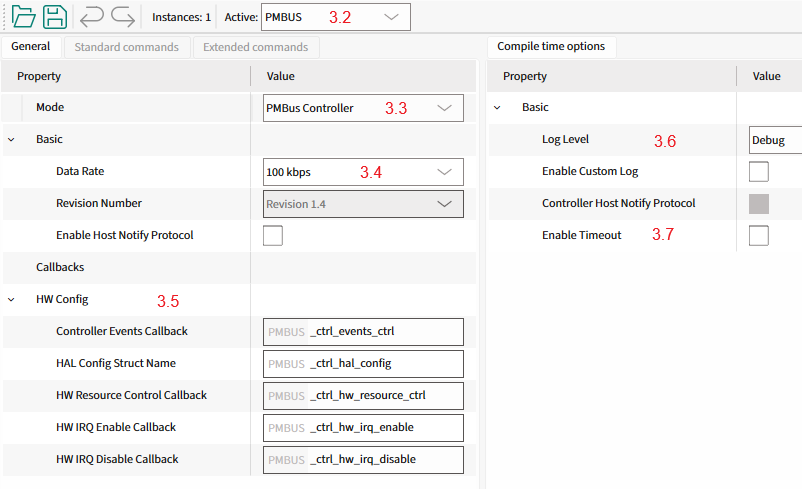

# Controller Mode Quick Start Guide (Using Solution Personality)

This section provides a guide to quickly get started with the PMBus middleware using the Solution personality.
Namely: how to set up the PMBus middleware in your project, configure the necessary hardware, and implement the basic PMBus controller functionality.

> **Note:** Testing the Controller mode functionality requires a second PMBus device operating in Target mode.
> Recommended: use the [Target Mode Quick Start Guide (Using Solution Personality)](target_mode_personality_quick_start.md) to set up the PMBus Target device.

## 1. Add mtb-pmbus middleware to your project


- If you work in the ModusToolbox IDE, use the ModusToolbox Library Manager to add the mtb-pmbus middleware to your project.
  Otherwise, ensure that mtb-pmbus middleware is included into your project.

> **Note:** Middleware uses printf() for logging purposes.
> To use printf() for the terminal output, add [retarget-io middleware](https://infineon.github.io/retarget-io/html/index.html) from the Library Manager or in any other way.

## 2. Configure SCB blocks, timeout Timer, GPIO pins

1. Open the Device Configurator and go to the Solutions tab (#1.0).
2. Add a new PMBus instance to your project (#1.1).
3. Select a name for the newly created PMBus instance (e.g., PMBUS, #1.2).
4. "I2C_HW" section (#1.3) - select:
   - the desired SCB block
   - the desired Clock for the selected SCB block
   - the desired pins for SDA and SCL lines, the Device Configurator will automatically configure them into Open Drain mode.
5. "Timeout Detection" section (#1.4) - select the timeout detection option and Clock for this option:
   - TGS (Time Guard Support), uses the SCB block time guard feature to detect the timeout conditions on the I2C bus.
   - TCPWM (Timer Counter Pulse Width Modulator), uses a dedicated timer to detect the timeout conditions on the I2C bus.

> **Note:** The selection of the timeout detection option depends on the device.


6. On the Peripherals tab (#2.0), enable the SCB block under Communication (#2.1), and select the UART personality (#2.2).
   Select the desired name for the SCB (#2.3). This block will be used for the debug output.
7. Select the desired pins and clock for the SCB (#2.4). The other UART options can be set by default, see the screenshot.


## 3. Configure PMBus instance

1. On the Solutions tab (#3.0), open the PMBus Configurator (#3.1).


2. Set the operation mode of the PMBus instance (#3.2) to Controller (#3.3).
3. Select the desired data rate (#3.4).
4. Define the names of the Controller callbacks (#3.5) to be used in the code implementation.
5. Set the log level to Debug (#3.6).
6. Disable the PMBus timeout detection to make the example simpler (#3.7).



7. Select File->Save to generate initialization code.

> **Warning:** Important! Save the PMBus configuration using the PMBus Configurator.

## 4. Add PMBus controller code to your project

This section describes:
- the implementation of a PMBus Controller device using the Solution personality
- how to send Quick Command and Read 32 protocols with the CMD1(0x10) command to the PMBus target device by using dedicated protocol APIs
- how to use generic transfer API to send Write Byte protocol with PAGE(0x00) command and Write/Read Word with the CMD2(0x11) command.

**Step 1.** Include the necessary header files into the main.c file:

```c
#include "mtb_pmbus.h"
#include "cybsp.h"
#include "cy_retarget_io.h"
```

**Step 2.** Set the project defines:

```c
#define PMBUS_TARGET_ADDRESS        (0x18U)

#define PMBUS_PAGE_CMD_CODE         (0x00U)
#define PMBUS_TEST_CMD_1_CODE       (0x10U)
#define PMBUS_TEST_CMD_2_CODE       (0x11U)

#define PMBUS_TEST_PAGE_NUM         (0x01U)
/* 1 second timeout in microseconds */
#define PMBUS_CTRL_TIMEOUT_US       (1000000UL)
```

**Step 3.** Create variables for:

Debug the UART HAL object and context:

```c
/* Debug UART variables */
static cy_stc_scb_uart_context_t    DEBUG_UART_context; /* UART context */
static mtb_hal_uart_t               DEBUG_UART_hal_obj; /* UART HAL object */
```

I2C context:

```c
static cy_stc_scb_i2c_context_t  i2c_pdl_context;
```

PMBus controller instance:

```c
static mtb_pmbus_ctrl_stc_t qsg_ctrl_inst;
```

**Step 4.** Implement the I2C interrupt handler function:

```c
static void PMBUS_i2c_isr(void)
{
    mtb_pmbus_ctrl_isr(&qsg_ctrl_inst);
}
```

**Step 5.** Implement the callback functions for:

Controlling I2C hardware resources (init, enable, disable) and enabling/disabling I2C interrupts:

```c
void PMBUS_ctrl_hw_resource_ctrl(mtb_pmbus_ctrl_hw_resources_ctrl_action_t action)
{
    if (action == MTB_PMBUS_CTRL_HW_RESOURCES_INIT)
    {
        /* Initialize I2C */
        Cy_SCB_I2C_Init(PMBUS_I2C_HW, &PMBUS_I2C_config, &i2c_pdl_context);

        /* Configure and initialize I2C interrupt */
        cy_stc_sysint_t i2c_isr_cfg =
        {
            .intrSrc = PMBUS_I2C_IRQ,
            .intrPriority = 3U
        };

        Cy_SysInt_Init(&i2c_isr_cfg, PMBUS_i2c_isr);

        printf("I2C hardware initialized\n\r");
    }
    else if (action == MTB_PMBUS_CTRL_HW_RESOURCES_ENABLE)
    {
        Cy_SCB_I2C_Enable(PMBUS_I2C_HW);
        printf("I2C hardware enabled\n\r");
    }
    else if (action == MTB_PMBUS_CTRL_HW_RESOURCES_DISABLE)
    {
        Cy_SCB_I2C_Disable(PMBUS_I2C_HW, &i2c_pdl_context);
        printf("I2C hardware disabled\n\r");
    }
}

void PMBUS_ctrl_events_ctrl(mtb_pmbus_ctrl_events_t event)
{
    /* Handle Controller events (if required) */
    (void)event;
}

void PMBUS_ctrl_hw_irq_enable(void)
{
    NVIC_EnableIRQ((IRQn_Type) PMBUS_I2C_IRQ);
}

void PMBUS_ctrl_hw_irq_disable(void)
{
    NVIC_DisableIRQ((IRQn_Type) PMBUS_I2C_IRQ);
}
```

**Step 6.** Implement the PMBus controller hardware configuration structure:

```c
mtb_pmbus_ctrl_stc_config_hal_t PMBUS_ctrl_hal_config =
{
    .hw_ptr = PMBUS_I2C_HW,
    .pdl_i2c_context = &i2c_pdl_context,
};
```

**Step 7.** (From this step, add code to the main() function) Create variables for the result statuses:

```c
cy_rslt_t result;
cy_en_scb_uart_status_t init_status;
```

**Step 8.** Initialize the device and board peripherals:

```c
    /* Initialize the device and board peripherals */
    result = cybsp_init();

    /* Board init failed. Stop program execution */
    if (result != CY_RSLT_SUCCESS)
    {
        CY_ASSERT(0);
    }
```

**Step 9.** Initialize the UART for the debug output:

```c
    /* Start UART operation */
    init_status = Cy_SCB_UART_Init(DEBUG_UART_HW, &DEBUG_UART_config, &DEBUG_UART_context);
    if (init_status != CY_SCB_UART_SUCCESS)
    {
        CY_ASSERT(0);
    }

    /* Enable UART */
    Cy_SCB_UART_Enable(DEBUG_UART_HW);

    /* Setup the HAL UART */
    result = mtb_hal_uart_setup(&DEBUG_UART_hal_obj, &DEBUG_UART_hal_config,
                                &DEBUG_UART_context, NULL);

    /* HAL UART init failed. Stop program execution */
    if (result != CY_RSLT_SUCCESS)
    {
        CY_ASSERT(0);
    }

    /* Initialize redirecting of low level IO */
    result = cy_retarget_io_init(&DEBUG_UART_hal_obj);

    /* retarget IO init failed. Stop program execution */
    if (result != CY_RSLT_SUCCESS)
    {
        CY_ASSERT(0);
    }

    /* Transmit header to the terminal */
    /* \x1b[2J\x1b[;H - ANSI ESC sequence for clear screen */
    printf("\x1b[2J\x1b[;H");

    printf("************************************************************\r\n");
    printf("PMBus Controller Quick Start Guide CE\r\n");
    printf("************************************************************\r\n\n");
```

**Step 10.** Enable the global interrupts:

```c
    /* Enable global interrupts */
    __enable_irq();
```

**Step 11.** Initialize and enable the PMBus Controller middleware instance:

```c
    mtb_pmbus_ctrl_status_t status;

    /* Initialize PMBus controller */
    status = mtb_pmbus_ctrl_init(&qsg_ctrl_inst, &PMBUS_ctrl_config);

    if (MTB_PMBUS_CTRL_STATUS_SUCCESS != status)
    {
        /* Handle the error status */
        printf("PMBus Controller initialization failed! Status: %d\n\r", status);
        CY_ASSERT(0);
    }
    else
    {
        printf("PMBus Controller initialized successfully\n\r");

        /* Enable the controller */
        mtb_pmbus_ctrl_enable(&qsg_ctrl_inst);
        printf("PMBus Controller enabled\n\r");
    }
```

**Step 12.** Execute the Quick Command protocol example:

```c
    printf("\n\r");
    printf("====================================\n\r");
    printf("Starting PMBus Controller Examples\n\r");
    printf("====================================\n\r");

    /* Wait a bit before starting transfers */
    Cy_SysLib_Delay(1000U);

    /* Example 1: Send Quick Command to toggle LED on target device */
    printf("\n\r--- Example 1: Quick Command ---\n\r");
    printf("Sending Quick Command to address 0x%02X (toggles target LED)\n\r", PMBUS_TARGET_ADDRESS);

    status = mtb_pmbus_ctrl_ex_quick_cmd(&qsg_ctrl_inst, PMBUS_TARGET_ADDRESS);

    if (status == MTB_PMBUS_CTRL_STATUS_SUCCESS)
    {
        /* Wait for transfer completion (1 second timeout) */
        status = mtb_pmbus_ctrl_wait_cmpl(&qsg_ctrl_inst, PMBUS_CTRL_TIMEOUT_US);

        if (status == MTB_PMBUS_CTRL_STATUS_IS_READY)
        {
            printf("Quick Command sent successfully\n\r");
        }
        else if (status == MTB_PMBUS_CTRL_STATUS_TIMEOUT)
        {
            printf("Quick Command timeout\n\r");
        }
        else
        {
            printf("Quick Command failed with status: %d\n\r", status);
        }
    }
    else
    {
        printf("Quick Command API failed with status: %d\n\r", status);
    }

    /* A short delay before next example */
    Cy_SysLib_Delay(500U);
```

**Step 13.** Execute the Read 32 protocol example:

```c
    /* Example 2: Read 32-bit data using Read 32 protocol */
    printf("\n\r--- Example 2: Read 32 Protocol ---\n\r");
    printf("Reading 4 bytes from CMD1 (0x%02X) - LED toggle counter\n\r", PMBUS_TEST_CMD_1_CODE);
    uint8_t read32_buffer[4U] = {0U};
    status = mtb_pmbus_ctrl_ex_read_32(&qsg_ctrl_inst, PMBUS_TARGET_ADDRESS, 
                                        PMBUS_TEST_CMD_1_CODE, read32_buffer, false);

    if (status == MTB_PMBUS_CTRL_STATUS_SUCCESS)
    {
        /* Wait for transfer completion (1 second timeout) */
        status = mtb_pmbus_ctrl_wait_cmpl(&qsg_ctrl_inst, PMBUS_CTRL_TIMEOUT_US);

        if (status == MTB_PMBUS_CTRL_STATUS_IS_READY)
        {
            uint32_t counter_value = read32_buffer[0U] | (read32_buffer[1U] << 8) |
                                     (read32_buffer[2U] << 16) | (read32_buffer[3U] << 24);
            printf("Read 32 completed successfully\n\r");
            printf("Counter value: %" PRIu32 "\n\r", counter_value);
        }
        else if (status == MTB_PMBUS_CTRL_STATUS_TIMEOUT)
        {
            printf("Read 32 timeout\n\r");
        }
        else
        {
            printf("Read 32 failed with status: %d\n\r", status);
        }
    }
    else
    {
        printf("Read 32 API failed with status: %d\n\r", status);
    }

    /* A short delay before next example */
    Cy_SysLib_Delay(500U);
```

**Step 14.** Execute the generic transfer example - Send PAGE command:

```c
    /* Example 3: Use generic transfer API for PAGE command and Write/Read Word */
    printf("\n\r--- Example 3: Generic Transfer API ---\n\r");

    /* Step 3a: Send PAGE command using Write Byte protocol */
    printf("Setting PAGE to %d using generic transfer\n\r", PMBUS_TEST_PAGE_NUM);

    mtb_pmbus_ctrl_stc_transfer_cfg_t transfer_cfg;
    uint8_t page_data[2U];
    page_data[0U] = PMBUS_PAGE_CMD_CODE;  /* PAGE command */
    page_data[1U] = PMBUS_TEST_PAGE_NUM;  /* Page number */

    transfer_cfg.addr = PMBUS_TARGET_ADDRESS;
    transfer_cfg.data = page_data;
    transfer_cfg.wr_size = 2U;  /* Command code + data byte */
    transfer_cfg.rd_size = 0U;  /* No read */
    transfer_cfg.execute_stop = true;

    status = mtb_pmbus_ctrl_execute_transfer(&qsg_ctrl_inst, &transfer_cfg);

    if (status == MTB_PMBUS_CTRL_STATUS_SUCCESS)
    {
        /* Wait for transfer completion (1 second timeout) */
        status = mtb_pmbus_ctrl_wait_cmpl(&qsg_ctrl_inst, PMBUS_CTRL_TIMEOUT_US);

        if (status == MTB_PMBUS_CTRL_STATUS_IS_READY)
        {
            printf("PAGE command sent successfully\n\r");
        }
        else if (status == MTB_PMBUS_CTRL_STATUS_TIMEOUT)
        {
            printf("PAGE command timeout\n\r");
        }
        else
        {
            printf("PAGE command failed with status: %d\n\r", status);
        }
    }
    else
    {
        printf("PAGE command API failed with status: %d\n\r", status);
    }

    /* A short delay before next step */
    Cy_SysLib_Delay(500U);
```

**Step 15.** Execute the generic transfer example - Write Word to CMD2:

```c
    /* Step 3b: Write Word to CMD2 on selected page */
    printf("\n\rWriting 0xABCD to CMD2 (0x%02X) using generic transfer\n\r", PMBUS_TEST_CMD_2_CODE);

    uint8_t write_data[3U];
    write_data[0U] = PMBUS_TEST_CMD_2_CODE;  /* CMD2 command */
    write_data[1U] = 0xABU;
    write_data[2U] = 0xCDU;

    transfer_cfg.data = write_data;
    transfer_cfg.wr_size = 3U;  /* Command code + 2 data bytes */
    transfer_cfg.rd_size = 0U;

    status = mtb_pmbus_ctrl_execute_transfer(&qsg_ctrl_inst, &transfer_cfg);

    if (status == MTB_PMBUS_CTRL_STATUS_SUCCESS)
    {
        /* Wait for transfer completion (1 second timeout) */
        status = mtb_pmbus_ctrl_wait_cmpl(&qsg_ctrl_inst, PMBUS_CTRL_TIMEOUT_US);

        if (status == MTB_PMBUS_CTRL_STATUS_IS_READY)
        {
            printf("Write Word completed successfully\n\r");
        }
        else if (status == MTB_PMBUS_CTRL_STATUS_TIMEOUT)
        {
            printf("Write Word timeout\n\r");
        }
        else
        {
            printf("Write Word failed with status: %d\n\r", status);
        }
    }
    else
    {
        printf("Write Word API failed with status: %d\n\r", status);
    }

    /* A short delay before next step */
    Cy_SysLib_Delay(500U);
```

**Step 16.** Execute the generic transfer example - Read Word from CMD2:

```c
    /* Step 3c: Read Word from CMD2 on selected page */
    printf("\n\rReading from CMD2 (0x%02X) using generic transfer\n\r", PMBUS_TEST_CMD_2_CODE);

    uint8_t read_data[3U];
    read_data[0U] = PMBUS_TEST_CMD_2_CODE;  /* CMD2 command */

    transfer_cfg.data = read_data;
    transfer_cfg.wr_size = 1U;  /* Command code only */
    transfer_cfg.rd_size = 2U;  /* Read 2 bytes */

    status = mtb_pmbus_ctrl_execute_transfer(&qsg_ctrl_inst, &transfer_cfg);

    if (status == MTB_PMBUS_CTRL_STATUS_SUCCESS)
    {
        /* Wait for transfer completion (1 second timeout) */
        status = mtb_pmbus_ctrl_wait_cmpl(&qsg_ctrl_inst, PMBUS_CTRL_TIMEOUT_US);

        if (status == MTB_PMBUS_CTRL_STATUS_IS_READY)
        {
            printf("Read Word completed successfully\n\r");
            uint16_t word_value = read_data[1U] | (read_data[0U] << 8);
            printf("Word value: 0x%04" PRIX16 "\n\r", word_value);
        }
        else if (status == MTB_PMBUS_CTRL_STATUS_TIMEOUT)
        {
            printf("Read Word timeout\n\r");
        }
        else
        {
            printf("Read Word failed with status: %d\n\r", status);
        }
    }
    else
    {
        printf("Read Word API failed with status: %d\n\r", status);
    }

    printf("\n\r====================================\n\r");
    printf("Examples completed\n\r");
    printf("====================================\n\r");
```

## 5. Verify Controller Mode Workability

See [Verify Controller Mode Workability](verify_controller_mode.md) for verification steps.

