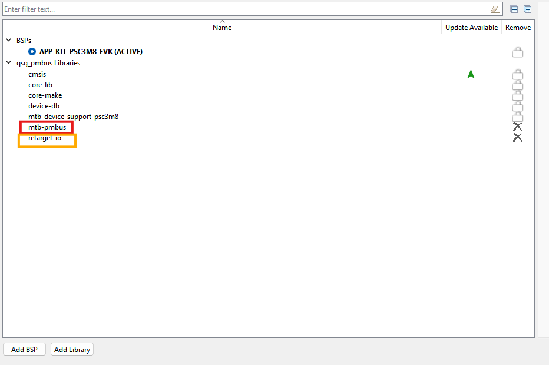
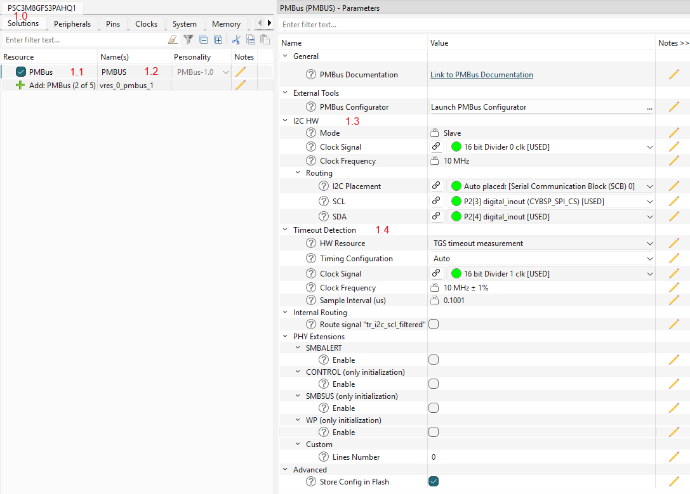
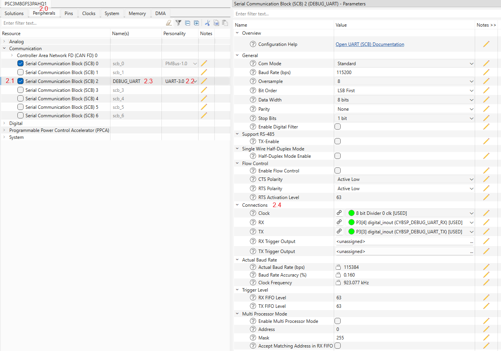
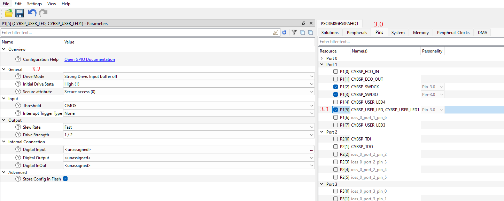
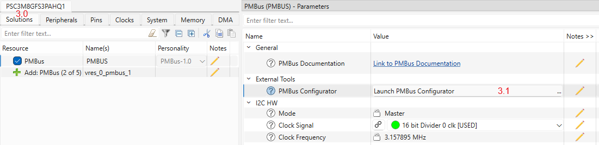
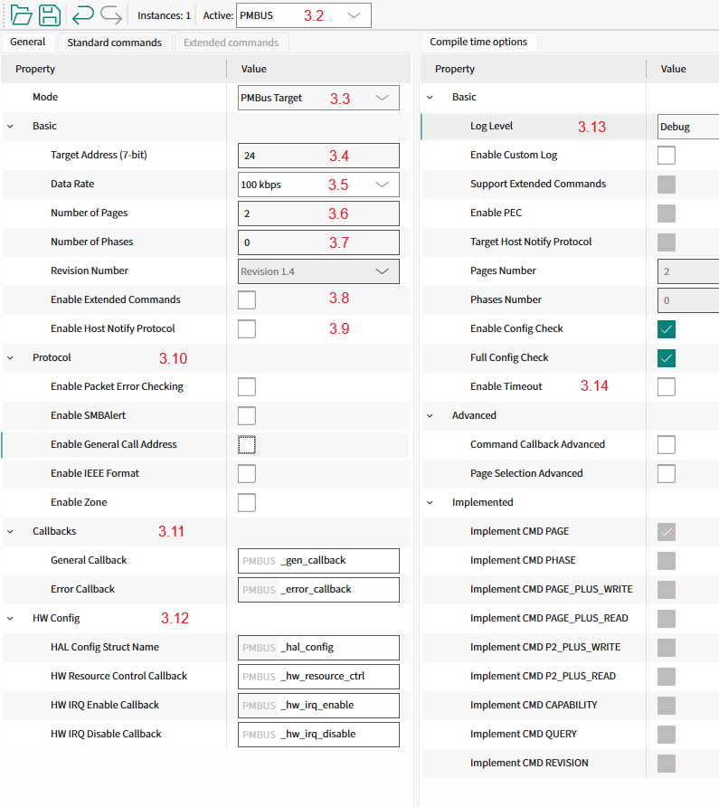
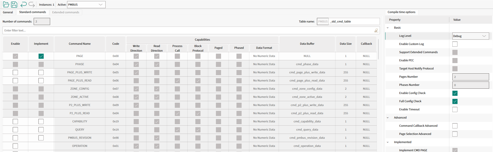
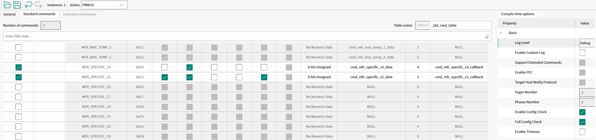

# Target Mode Quick Start Guide (Using Solution Personality)

This section provides a guide to quickly get started with the PMBus middleware using Solution personality.
Namely: how to set up the PMBus middleware in your project, configure the necessary hardware, and implement the basic PMBus target functionality.

## 1. Add mtb-pmbus middleware to your project



- If you work in the ModusToolbox IDE, use the ModusToolbox Library Manager to add the mtb-pmbus middleware to your project.
  Otherwise, ensure that mtb-pmbus middleware is included into your project.

> **Note:** Middleware uses printf() for logging purposes.
> To use printf() for the terminal output, add [retarget-io middleware](https://infineon.github.io/retarget-io/html/index.html) from the Library Manager or in any other way.

## 2. Configure SCB blocks, timeout Timer, GPIO pins

1. Open the Device Configurator and go to the Solutions tab (#1.0).
2. Add a new PMBus instance to your project (#1.1).
3. Select a name for the newly created PMBus instance (e.g., PMBUS, #1.2).
4. "I2C_HW" section (#1.3) - select:
   - the desired SCB block
   - the desired Clock for the selected SCB block
5. "I2C_HW->Routing" section - select:
   - the desired pins for SDA and SCL lines, the Device Configurator will automatically configure them into Open Drain mode.
6. "Timeout Detection" section (#1.4) - select the timeout detection option and select Clock for it:
   - TGS (Time Guard Support), uses the SCB block time guard feature to detect the timeout conditions on the I2C bus.
   - TCPWM (Timer Counter Pulse Width Modulator), uses a dedicated timer to detect the timeout conditions on the I2C bus.

> **Note:** The selection of the timeout detection option depends on the device.



7. In the Peripherals tab (#2.0), enable the SCB block under Communication (#2.1) and select the UART personality (#2.2).
   Select the desired name for the SCB (#2.3). This block will be used for the debug output.
8. Select the desired pins and clock for the SCB (#2.4). The other UART options can be set by default, see the screenshot.



9. Switch to the Pins tab (#3.0) and enable any User LED GPIO pin (#3.1). In the "General" section (#3.2), select the Strong Drive, input buffer-off Drive mode.



## 3. Configure PMBus instance

1. In the Solutions tab (#3.0), open the PMBus Configurator (#3.1).



2. Set the operation mode of the PMBus instance (#3.2) to Target (#3.3).
3. Define the Target device address (#3.4).
4. Select the desired data rate (#3.5).
5. Select the number of supported Pages by PMBus middleware (#3.6).
6. Select the number of supported Phases by PMBus middleware (#3.7).
7. Disable the support for Extended Commands (#3.8) - not needed.
8. Disable the Host Notify Protocol support (#3.9) and other PMBus features (#3.10) to simplify the example.
9. Use the default names for Target callbacks (#3.11) and other PMBus data types (#3.12).
10. Set the log level to Debug (#3.13).
11. Disable the PMBus timeout detection to simplify the example (#3.14).



12. Unselect any unnecessary pre-implemented commands as shown in the picture below.



13. Configure the manufacturer-specific commands as shown in the picture below.
    - cmd_mfr_specific_c4_callback, cmd_mfr_specific_c4_data
    - cmd_mfr_specific_c5_callback, cmd_mfr_specific_c5_data



14. Select File->Save to generate initialization code.

> **Warning:** Important! Save the PMBus configuration using the PMBus Configurator.

## 4. Add PMBus code to your project

This section describes the implementation of the PMBus target device.
The implementation supports the Quick Command and Read 32 protocols, PAGE command and Write/Read Word protocols with pages.

**Step 1.** Include the necessary headers files in the main.c file:

```c
#include "mtb_pmbus.h"
#include "cybsp.h"
#include "cy_retarget_io.h"
```

**Step 2.** Set the project defines:

```c
#define PMBUS_DEVICE_ADDRESS        (0x18U)
#define PMBUS_CMD_TABLE_SIZE        (2U)
#define PMBUS_TOTAL_NUM_PAGES       (2U)

#define PMBUS_TEST_CMD_1_CODE       (0xC4U)
#define PMBUS_TEST_CMD_1_SIZE       (4U)

#define PMBUS_TEST_CMD_2_CODE       (0xC5U)
#define PMBUS_TEST_CMD_2_SIZE       (2U)
#define PMBUS_TEST_CMD_2_PAGES      (2U)
```

**Step 3.** Create variables for:

Debug UART HAL object and context:

```c
/* Debug UART variables */
static cy_stc_scb_uart_context_t    DEBUG_UART_context; /* UART context */
static mtb_hal_uart_t               DEBUG_UART_hal_obj; /* UART HAL object */
```

I2C context:

```c
static cy_stc_scb_i2c_context_t  i2c_pdl_context;
```

PMBus instance:

```c
static mtb_pmbus_stc_t qsg_pmbus_inst;
```

Example data:

```c
volatile uint32_t user_led_toggled_cnt = 0U;
volatile uint16_t user_data = 0U;
```

**Step 4.** Implement the General event callback function:

```c
void PMBUS_gen_callback(mtb_pmbus_events_t event)
{
    if (event == MTB_PMBUS_QUICK_CMD_WR_EVENT)
    {
        printf("Gen: MTB_PMBUS_QUICK_CMD_WR_EVENT\n\r");
        /* Toggle User LED on quick write command */
        Cy_GPIO_Inv(CYBSP_USER_LED_PORT, CYBSP_USER_LED_PIN);
        user_led_toggled_cnt++;
        printf("User LED toggled\n\r"); 
    }
}
```

**Step 5.** Implement the error event callback function:

```c
void PMBUS_error_callback(uint32_t events, uint8_t cmd_code, bool cmd_is_ext)
{
    /* Handle error events (if required) */
    (void)events;
    (void)cmd_code;
    (void)cmd_is_ext;
}
```

**Step 6.** Implement the PMBus command callback functions:

```c
bool cmd_mfr_specific_c4_callback(mtb_pmbus_cmd_events_t event, int32_t page, int32_t phase, uint8_t byte)
{
    /* Avoid compiler warnings */
    (void) page;
    (void) phase;
    (void) byte;

    if (event == MTB_PMBUS_CMD_MATCH)
    {
        printf("\n\rCMD1 match\n\r");
    }
    else if (event == MTB_PMBUS_CMD_READ_REQ)
    {
        printf("\n\rCMD1 read request\n\r");
        /* Local copy */
        uint32_t tmp = user_led_toggled_cnt;
        /* Put the number of times the User LED was toggled in cmd buffer */
        mtb_pmbus_cmd_update_data_isr(&qsg_pmbus_inst, PMBUS_TEST_CMD_1_CODE, (uint8_t*)&tmp, PMBUS_TEST_CMD_1_SIZE);
        printf("Data buffer for read: 0x%02X\n\r", cmd_mfr_specific_c4_data[0U]);
    }

    return true;
}
```

```c
bool cmd_mfr_specific_c5_callback(mtb_pmbus_cmd_events_t event, int32_t page, int32_t phase, uint8_t byte)
{
    /* Avoid compiler warnings */
    (void) byte;
    (void) phase;
    if (event == MTB_PMBUS_CMD_MATCH)
    {
        printf("\n\rCMD2 match\n\r");
        /* Local copy */
        uint16_t tmp = user_data;
        /* Update the cmd buffer using local data */
        mtb_pmbus_cmd_update_data_ext_isr(&qsg_pmbus_inst, PMBUS_TEST_CMD_2_CODE, page, phase, (uint8_t*)&tmp, PMBUS_TEST_CMD_2_SIZE);
        printf("Data buffer for page %" PRId32 ": 0x%02X 0x%02X\n\r", page, cmd_mfr_specific_c5_data[page][0U], cmd_mfr_specific_c5_data[page][1U]);
    }
    else if (event == MTB_PMBUS_CMD_WRITE_DONE)
    {
        printf("\n\rCMD2 write done\n\r");
        printf("Data buffer after write for page %" PRId32 ": 0x%02X 0x%02X\n\r", page, cmd_mfr_specific_c5_data[page][0U], cmd_mfr_specific_c5_data[page][1U]);
        uint16_t tmp;
        /* Update the local data using cmd buffer */
        mtb_pmbus_cmd_read_data_ext_isr(&qsg_pmbus_inst, PMBUS_TEST_CMD_2_CODE, page, phase, (uint8_t*)&tmp, PMBUS_TEST_CMD_2_SIZE);
        /* Copy to storage */
        user_data = tmp;
    }

    return true;
}
```

**Step 7.** Implement the I2C interrupt handler function:

```c
void PMBUS_i2c_isr(void)
{
    mtb_pmbus_i2c_isr(&qsg_pmbus_inst);
}
```

**Step 8.** Implement the callback functions for:

Enabling and disabling the I2C:

```c
void PMBUS_hw_resource_ctrl(mtb_pmbus_hw_resources_ctrl_action_t action)
{
    if (action == MTB_PMBUS_HW_RESOURCES_ENABLE)
    {
        Cy_SCB_I2C_Enable(PMBUS_I2C_HW);
    }
    else if (action == MTB_PMBUS_HW_RESOURCES_DISABLE)
    {
        Cy_SCB_I2C_Disable(PMBUS_I2C_HW, &i2c_pdl_context);
    }
}
```

Enabling and disabling I2C interrupts:

```c
void PMBUS_hw_irq_enable(void)
{
    NVIC_EnableIRQ((IRQn_Type) PMBUS_I2C_IRQ);
}
 
void PMBUS_hw_irq_disable(void)
{
    NVIC_DisableIRQ((IRQn_Type) PMBUS_I2C_IRQ);
}
```

**Step 9.** Implement the PMBus HAL configuration structure:

```c
mtb_pmbus_stc_config_hal_t PMBUS_hal_config =
{
    .hw_ptr = PMBUS_I2C_HW,
    .pdl_i2c_context = &i2c_pdl_context,
};
```

**Step 10.** (From this step add code to the main() function) Create variables for the result statuses:

```c
cy_rslt_t result;
cy_en_scb_uart_status_t init_status;
```

**Step 11.** Initialize the device and board peripherals:

```c
    /* Initialize the device and board peripherals */
    result = cybsp_init();

    /* Board init failed. Stop program execution */
    if (result != CY_RSLT_SUCCESS)
    {
        CY_ASSERT(0);
    }
```

**Step 12.** Initialize the UART for debug output:

```c
    /* Start UART operation */
    init_status = Cy_SCB_UART_Init(DEBUG_UART_HW, &DEBUG_UART_config, &DEBUG_UART_context);
    if (init_status!=CY_SCB_UART_SUCCESS)
    {
         CY_ASSERT(0);
    }
    
    /* Enable UART */
    Cy_SCB_UART_Enable(DEBUG_UART_HW);

    /* Setup the HAL UART */
    result = mtb_hal_uart_setup(&DEBUG_UART_hal_obj, &DEBUG_UART_hal_config,
                                &DEBUG_UART_context, NULL);

    /* HAL UART init failed. Stop program execution */
    if (result != CY_RSLT_SUCCESS)
    {
        CY_ASSERT(0);
    }

    /* Initialize redirecting of low level IO */
    result = cy_retarget_io_init(&DEBUG_UART_hal_obj);

    /* retarget IO init failed. Stop program execution */
    if (result != CY_RSLT_SUCCESS)
    {
        CY_ASSERT(0);
    }

    /* Transmit header to the terminal */
    /* \x1b[2J\x1b[;H - ANSI ESC sequence for clear screen */
    printf("\x1b[2J\x1b[;H");

    printf("************************************************************\r\n");
    printf("PMBus Quick Start Guide CE\r\n");
    printf("************************************************************\r\n\n");
```

**Step 13.** Enable irq:

```c
    /* Enable global interrupts */
    __enable_irq();
```

**Step 14.** Initialize the I2C hardware:

```c
    /* Initialize I2C */
    Cy_SCB_I2C_Init(PMBUS_I2C_HW, &PMBUS_I2C_config, &i2c_pdl_context);

    /* Configure and initialize I2C interrupt */
    cy_stc_sysint_t i2c_isr_cfg =
    {
        .intrSrc = PMBUS_I2C_IRQ,
        .intrPriority = 3U
    };

    Cy_SysInt_Init(&i2c_isr_cfg, PMBUS_i2c_isr);

    /* Log successful initialization */
    MTB_PMBUS_LOG_INF("I2C transport is initialized");
```

**Step 15.** Initialize the PMBus middleware instance:

```c
    mtb_pmbus_status_t status;

    status = mtb_pmbus_init(&qsg_pmbus_inst, &PMBUS_config);

    if (MTB_PMBUS_STATUS_SUCCESS != status)
    {
        /* Handle the error status */
        MTB_PMBUS_LOG_DBG("PMBus initialization failed!");
    }
    else
    {
        status = mtb_pmbus_enable(&qsg_pmbus_inst);

        if (MTB_PMBUS_STATUS_SUCCESS != status)
        {
            /* Handle the error status */
        }
    }
```

## 5. Verify Target Mode Workability

See [Verify Target Mode Workability](verify_target_mode.md) for verification steps.

