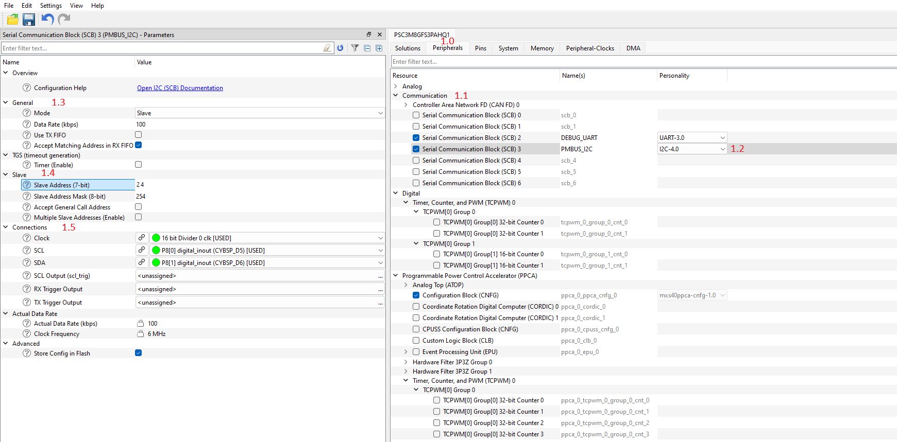
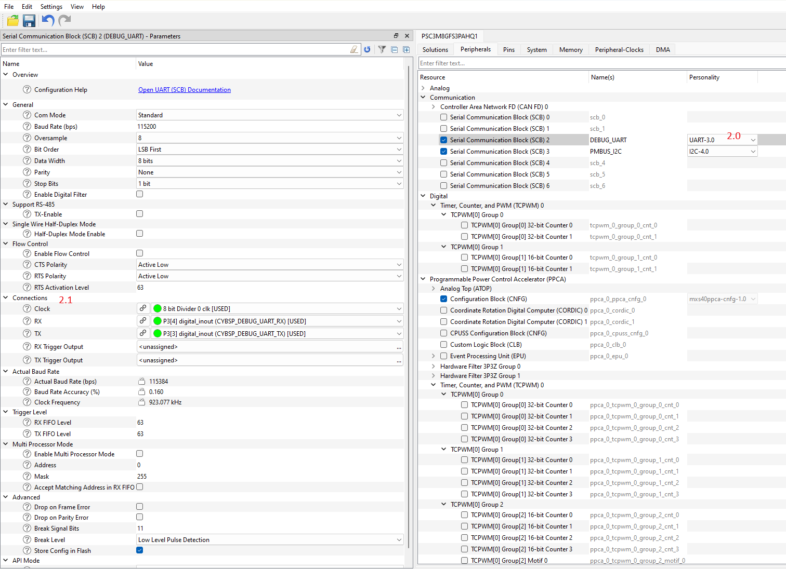

# Target Mode Quick Start Guide

This section provides a step-by-step guide to quickly get started with the PMBus middleware.
Namely: how to set up the PMBus middleware in your project, configure the
necessary hardware, and implement the basic SMBus/PMBus target functionality.

## 1. Add mtb-pmbus middleware to your project


- If you work in the ModusToolbox IDE, use the ModusToolbox Library Manager to add the mtb-pmbus middleware to your project.
  Otherwise, ensure that mtb-pmbus middleware is included into your project.

> **Note:** Middleware uses printf() for logging purposes.
> To use printf() for the terminal output, add [retarget-io middleware](https://infineon.github.io/retarget-io/html/index.html) from the Library Manager or in any other way.

## 2. Configure SCB blocks and GPIO pins

> **Note:** The following SCB I2C configuration steps are simplified for quick start.
> They will not cover all required settings to support all middleware features.
> For a detailed description of the complete SCB I2C configuration, refer to the API Reference Guide.

1. Open the Device Configurator and switch to the Peripherals tab (#1.0).
2. Enable the SCB block under Communication (#1.1) and select the I2C Personality (#1.2). Select the desired name for the SCB (e.g., PMBUS_I2C).
3. In the "General" section (#1.3), choose Slave mode and set the I2C Data Rate to the desired value (e.g., 100 kHz). Disable the "Use TX FIFO" option and enable the "Accept Matching Address" in RX FIFO option.
4. In the "Slave" section (#1.4), set the Slave Address to the desired SMBus/PMBus device address (e.g., 0x18).
5. In the "Connect" section (#1.5), select the desired Clock for the SCB block. Also, select the desired pins for SDA and SCL lines, the Device Configurator will automatically configure them to Open Drain mode.



6. Enable another SCB block under Communication and select UART Personality (#2.0). Select the desired name for the SCB. This block will be used for the debug output.
7. Select the desired pins and clock for the SCB (#2.1). The other UART options can be set by default, see the screenshot.



8. Switch to the Pins tab (#3.0) and enable any User LED GPIO pin (#3.1). In the "General" section (#3.2) select the Strong Drive, input buffer off Drive mode.


9. Select File->Save to generate initialization code.

## 3. Add SMBus/PMBus code to your project

This section describes the implementation of either an SMBus or PMBus target device.
The implementation is similar for both protocols, with some differences in the command table and configuration.
Both implementations support the Quick Command and Read 32 protocols,
while the PMBus implementation additionally supports the PAGE command and Write/Read Word protocols with pages.

**Step 1.** Fill the mtb_pmbus_conf.h file with the desired compile-time configuration macros.
This file will appear in the project import folder after adding the mtb-pmbus middleware.

> **Note:** This file is intended only for PMBus configuration without using the Device Configurator and solution personality.
> To enable this possibility, add define MTB_PMBUS_MANUAL_CONFIG to project's Makefile:
> ```
> DEFINES += MTB_PMBUS_MANUAL_CONFIG
> ```

```c
/* Option for configuring PMBus without using a personality */
#ifdef MTB_PMBUS_MANUAL_CONFIG

#ifndef MTB_PMBUS_CONF_H
#define MTB_PMBUS_CONF_H

#include "mtb_pmbus_log_level.h"

/* Modify the compile time options to reflect your configuration */

/* Enable all logging messages */
#define MTB_PMBUS_LOG_LEVEL                     (MTB_PMBUS_LOG_LEVEL_DEBUG)
/* Disable timeout detection to simplify the example */
#define MTB_PMBUS_ENABLE_TIMEOUT                (0U)

#endif /* MTB_PMBUS_CONF_H */

#endif /* MTB_PMBUS_MANUAL_CONFIG */
```

**Step 2.** Include the necessary headers files in main.c file:

```c
#include "mtb_pmbus.h"
#include "cybsp.h"
#include "cy_retarget_io.h"
```

**Step 3.** Set project defines:

For **PMBus** project:

```c
#define PMBUS_DEVICE_ADDRESS        (0x18U)
#define PMBUS_CMD_TABLE_SIZE        (2U)
#define PMBUS_TOTAL_NUM_PAGES       (2U)

#define PMBUS_TEST_CMD_1_CODE       (0x10U)
#define PMBUS_TEST_CMD_1_SIZE       (4U)

#define PMBUS_TEST_CMD_2_CODE       (0x11U)
#define PMBUS_TEST_CMD_2_SIZE       (2U)
#define PMBUS_TEST_CMD_2_PAGES      (2U)
```

For **SMBus** project:

```c
#define PMBUS_DEVICE_ADDRESS        (0x18U)
#define PMBUS_CMD_TABLE_SIZE        (1U)

#define PMBUS_TEST_CMD_1_CODE       (0x10U)
#define PMBUS_TEST_CMD_1_SIZE       (4U)
```

**Step 4.** Create variables for:

Debug UART HAL object and context:

```c
/* Debug UART variables */
static cy_stc_scb_uart_context_t    DEBUG_UART_context; /* UART context */
static mtb_hal_uart_t               DEBUG_UART_hal_obj; /* UART HAL object */
```

I2C context:

```c
static cy_stc_scb_i2c_context_t  i2c_pdl_context;
```

SMBus/PMBus instance:

```c
static mtb_pmbus_stc_t qsg_pmbus_inst;
```

**Step 5.** Implement General event callback function:

```c
void pmbus_gen_callback(mtb_pmbus_events_t event)
{
    if (event == MTB_PMBUS_QUICK_CMD_WR_EVENT)
    {
        printf("Gen: MTB_PMBUS_QUICK_CMD_WR_EVENT\n\r");
        /* Toggle User LED on quick write command */
        Cy_GPIO_Inv(CYBSP_USER_LED_PORT, CYBSP_USER_LED_PIN);
        user_led_toggled_cnt++;
        printf("User LED toggled\n\r"); 
    }
}
```

**Step 6.** Create buffers for SMBus/PMBus test commands:

For **PMBus** project:

```c
/* Command buffer */
static uint8_t pmbus_cmd1_buffer[PMBUS_TEST_CMD_1_SIZE] = {0U};
/* Data storage */
volatile uint32_t user_led_toggled_cnt = 0U;

/* Command buffer */
static uint8_t pmbus_cmd2_buffer[PMBUS_TEST_CMD_2_PAGES][PMBUS_TEST_CMD_2_SIZE] = {0U};
/* Data storage */
volatile uint16_t user_data = 0U;
```

For **SMBus** project:

```c
/* Command buffer */
static uint8_t pmbus_cmd1_buffer[PMBUS_TEST_CMD_1_SIZE] = {0U};
/* Data storage */
volatile uint32_t user_led_toggled_cnt = 0U;
```

**Step 7.** Implement the SMBus/PMBus command callback functions:

For **PMBus** project:

```c
bool pmbus_cmd1_callback(mtb_pmbus_cmd_events_t event, int32_t page, int32_t phase, uint8_t byte)
{
    /* Avoid compiler warnings */
    (void) page;
    (void) phase;
    (void) byte;

    if (event == MTB_PMBUS_CMD_MATCH)
    {
        printf("\n\rCMD1 match\n\r");
    }
    else if (event == MTB_PMBUS_CMD_READ_REQ)
    {
        printf("\n\rCMD1 read request\n\r");
        /* Local copy */
        uint32_t tmp = user_led_toggled_cnt;
        /* Put the number of times the User LED was toggled in cmd buffer */
        mtb_pmbus_cmd_update_data_isr(&qsg_pmbus_inst, PMBUS_TEST_CMD_1_CODE, (uint8_t*)&tmp, PMBUS_TEST_CMD_1_SIZE);
        printf("Data buffer for read: 0x%02X\n\r", pmbus_cmd1_buffer[0U]);
    }

    return true;
}
```

```c
bool pmbus_cmd2_callback(mtb_pmbus_cmd_events_t event, int32_t page, int32_t phase, uint8_t byte)
{
    /* Avoid compiler warnings */
    (void) byte;
    (void) phase;
    if (event == MTB_PMBUS_CMD_MATCH)
    {
        printf("\n\rCMD2 match\n\r");
        /* Local copy */
        uint16_t tmp = user_data;
        /* Update the cmd buffer using local data */
        mtb_pmbus_cmd_update_data_ext_isr(&qsg_pmbus_inst, PMBUS_TEST_CMD_2_CODE, page, phase, (uint8_t*)&tmp, PMBUS_TEST_CMD_2_SIZE);
        printf("Data buffer for page %" PRId32 ": 0x%02X 0x%02X\n\r", page, pmbus_cmd2_buffer[page][0U], pmbus_cmd2_buffer[page][1U]);
    }
    else if (event == MTB_PMBUS_CMD_WRITE_DONE)
    {
        printf("\n\rCMD2 write done\n\r");
        printf("Data buffer after write for page %" PRId32 ": 0x%02X 0x%02X\n\r", page, pmbus_cmd2_buffer[page][0U], pmbus_cmd2_buffer[page][1U]);
        uint16_t tmp;
        /* Update the local data using cmd buffer */
        mtb_pmbus_cmd_read_data_ext_isr(&qsg_pmbus_inst, PMBUS_TEST_CMD_2_CODE, page, phase, (uint8_t*)&tmp, PMBUS_TEST_CMD_2_SIZE);
        /* Copy to storage */
        user_data = tmp;
    }

    return true;
}
```

For **SMBus** project (only pmbus_cmd1_callback is needed).

**Step 8.** Implement the SMBus/PMBus command table:

For **PMBus** project:

```c
/* PMBus command table - TEST_CMD_1 and TEST_CMD_2 (with page support) */
static mtb_pmbus_stc_config_cmd_t cmd_table[] =
{
    /* TEST_CMD_1: Read LED Toggles counter */
    {
        .cmd_code   = PMBUS_TEST_CMD_1_CODE,
        .cmd_cap    = MTB_PMBUS_CMD_CAP_DIR_RD | MTB_PMBUS_CMD_CAP_FORMAT_8_BIT,
        .data_buf   = pmbus_cmd1_buffer,
        .callback   = pmbus_cmd1_callback,
        .data_size  = PMBUS_TEST_CMD_1_SIZE,
    },
    /* TEST_CMD_2: Write and Read with Page support */
    {
        .cmd_code   = PMBUS_TEST_CMD_2_CODE,
        .cmd_cap    = MTB_PMBUS_CMD_CAP_DIR_WR | MTB_PMBUS_CMD_CAP_DIR_RD | MTB_PMBUS_CMD_CAP_PAGE | MTB_PMBUS_CMD_CAP_FORMAT_8_BIT,
        .data_buf   = pmbus_cmd2_buffer,
        .callback   = pmbus_cmd2_callback,
        .data_size  = PMBUS_TEST_CMD_2_SIZE,
    }
};
```

For **SMBus** project:

```c
/* SMBus command table - only TEST_CMD_1 (no page support) */
static mtb_pmbus_stc_config_cmd_t cmd_table[] =
{
    /* TEST_CMD_1: Read LED Toggles counter */
    {
        .cmd_code   = PMBUS_TEST_CMD_1_CODE,
        .cmd_cap    = MTB_PMBUS_CMD_CAP_DIR_RD | MTB_PMBUS_CMD_CAP_FORMAT_8_BIT,
        .data_buf   = pmbus_cmd1_buffer,
        .callback   = pmbus_cmd1_callback,
        .data_size  = PMBUS_TEST_CMD_1_SIZE,
    }
};
```

**Step 9.** Implement I2C interrupt handler function:

```c
void i2c_isr(void)
{
    mtb_pmbus_i2c_isr(&qsg_pmbus_inst);
}
```

**Step 10.** Implement callback functions for enabling and disabling the I2C and I2C interrupts:

```c
void hw_resource_enable_callback(mtb_pmbus_hw_resources_ctrl_action_t action)
{
    if (action == MTB_PMBUS_HW_RESOURCES_ENABLE)
    {
        Cy_SCB_I2C_Enable(PMBUS_I2C_HW);
    }
    else if (action == MTB_PMBUS_HW_RESOURCES_DISABLE)
    {
        Cy_SCB_I2C_Disable(PMBUS_I2C_HW, &i2c_pdl_context);
    }
}
```

```c
void hw_isr_enable(void)
{
    NVIC_EnableIRQ((IRQn_Type) PMBUS_I2C_IRQ);
}
 
void hw_isr_disable(void)
{
    NVIC_DisableIRQ((IRQn_Type) PMBUS_I2C_IRQ);
}
```

**Step 11.** Implement the SMBus/PMBus hardware configuration structure:

```c
static mtb_pmbus_stc_config_hal_t pmbus_hal_cfg =
{
    .hw_ptr = PMBUS_I2C_HW,
    .pdl_i2c_context = &i2c_pdl_context,
};

static mtb_pmbus_stc_config_hw_t pmbus_hw_cfg =
{
    .hal_config = &pmbus_hal_cfg,
    .hw_resource_ctrl_callback = hw_resource_enable_callback,
    .enable_hw_irq_callback = hw_isr_enable,
    .disable_hw_irq_callback = hw_isr_disable
};
```

**Step 12.** Implement the SMBus/PMBus configuration structure:

For **PMBus** project:

```c
static mtb_pmbus_stc_config_t pmbus_cfg =
{
    /* Pointer to hardware configuration structure */
    .hw_config = &pmbus_hw_cfg,
    /* PMBus device address (7-bit) */
    .address = PMBUS_DEVICE_ADDRESS,
    /* Disable PEC support for minimal test */
    .enable_pec = false,
    /* Enable SMBALERT signal */
    .enable_smbalert = false,
    /* Enable PMBus features */
    .enable_pmbus = true,
    /* Enable pages for PMBus test */
    .num_pages = PMBUS_TOTAL_NUM_PAGES,
    /* Enable phases for PMBus test*/
    .num_phases = 0U,
    /* Zone Write and Zone Read protocols are disabled for minimal test */
    .enable_zone = false,
    /* No implemented PMBus commands */
    .impl_cmd_mask = MTB_PMBUS_IMPL_CMD_PAGE_EN,
    /* Pointer to simple test command table */
    .cmd_table = cmd_table,
    /* Number of commands in test table */
    .cmd_num = PMBUS_CMD_TABLE_SIZE,
    /* General call address disabled for minimal test */
    .enable_gen_call_addr = false,
    /* General event callback for minimal PMBus test */
    .gen_callback = pmbus_gen_callback,
    /* No error event callback for minimal PMBus test */
    .errors_callback = NULL,
    /* PMBus revision */
    .revision = MTB_PMBUS_REVISION_1_4,
    /* PMBus speed (100 kHz) */
    .speed = MTB_PMBUS_SPEED_100,
    /* Numeric data format not used */
    .enable_ieee_format = false,
};
```

For **SMBus** project:

```c
static mtb_pmbus_stc_config_t pmbus_cfg =
{
    /* Pointer to hardware configuration structure */
    .hw_config = &pmbus_hw_cfg,
    /* SMBus device address (7-bit) */
    .address = PMBUS_DEVICE_ADDRESS,
    /* Disable PEC support for minimal test */
    .enable_pec = false,
    /* Enable SMBALERT signal */
    .enable_smbalert = false,
    /* Disable PMBus features, SMBus only */
    .enable_pmbus = false,
    /* Pages are not supported by SMBus */
    .num_pages = 0U,
    /* Phases are not supported by SMBus */
    .num_phases = 0U,
    /* Zone Write and Zone Read protocols are not supported by SMBus */
    .enable_zone = false,
    /* No implemented PMBus commands */
    .impl_cmd_mask = 0U,
    /* Pointer to simple test command table */
    .cmd_table = cmd_table,
    /* Number of commands in test table */
    .cmd_num = PMBUS_CMD_TABLE_SIZE,
    /* General call address disabled for minimal test */
    .enable_gen_call_addr = false,
    /* General event callback for minimal test */
    .gen_callback = pmbus_gen_callback,
    /* No error event callback for minimal test */
    .errors_callback = NULL,
    /* PMBus revision (not used for SMBus) */
    .revision = MTB_PMBUS_REVISION_1_4,
    /* SMBus speed (100 kHz) */
    .speed = MTB_PMBUS_SPEED_100,
    /* Numeric data format not used */
    .enable_ieee_format = false,
};
```

**Step 13.** (From this step add code to the main() function) Create variables for result statuses:

```c
cy_rslt_t result;
cy_en_scb_uart_status_t init_status;
```

**Step 14.** Initialize the device and board peripherals:

```c
    /* Initialize the device and board peripherals */
    result = cybsp_init();

    /* Board init failed. Stop program execution */
    if (result != CY_RSLT_SUCCESS)
    {
        CY_ASSERT(0);
    }
```

**Step 15.** Initialize the UART for debug output:

```c
    /* Start UART operation */
    init_status = Cy_SCB_UART_Init(DEBUG_UART_HW, &DEBUG_UART_config, &DEBUG_UART_context);
    if (init_status!=CY_SCB_UART_SUCCESS)
    {
         CY_ASSERT(0);
    }
    
    /* Enable UART */
    Cy_SCB_UART_Enable(DEBUG_UART_HW);

    /* Setup the HAL UART */
    result = mtb_hal_uart_setup(&DEBUG_UART_hal_obj, &DEBUG_UART_hal_config,
                                &DEBUG_UART_context, NULL);

    /* HAL UART init failed. Stop program execution */
    if (result != CY_RSLT_SUCCESS)
    {
        CY_ASSERT(0);
    }

    /* Initialize redirecting of low level IO */
    result = cy_retarget_io_init(&DEBUG_UART_hal_obj);

    /* retarget IO init failed. Stop program execution */
    if (result != CY_RSLT_SUCCESS)
    {
        CY_ASSERT(0);
    }

    /* Transmit header to the terminal */
    /* \x1b[2J\x1b[;H - ANSI ESC sequence for clear screen */
    printf("\x1b[2J\x1b[;H");

    printf("************************************************************\r\n");
    printf("PMBus Quick Start Guide CE\r\n");
    printf("************************************************************\r\n\n");
```

**Step 16.** Enable irq:

```c
    /* Enable global interrupts */
    __enable_irq();
```

**Step 17.** Initialize the I2C hardware:

```c
    /* Initialize I2C */
    Cy_SCB_I2C_Init(PMBUS_I2C_HW, &PMBUS_I2C_config, &i2c_pdl_context);

    /* Configure and initialize I2C interrupt */
    cy_stc_sysint_t i2c_isr_cfg =
    {
        .intrSrc = PMBUS_I2C_IRQ,
        .intrPriority = 3U
    };

    Cy_SysInt_Init(&i2c_isr_cfg, i2c_isr);

    /* Log successful initialization */
    MTB_PMBUS_LOG_INF("I2C transport is initialized");
```

**Step 18.** Initialize the SMBus/PMBus middleware instance:

```c
    mtb_pmbus_status_t status;

    status = mtb_pmbus_init(&qsg_pmbus_inst, &pmbus_cfg);

    if (MTB_PMBUS_STATUS_SUCCESS != status)
    {
        /* Handle the error status */
        MTB_PMBUS_LOG_DBG("PMBus initialization failed!");
    }
    else
    {
        status = mtb_pmbus_enable(&qsg_pmbus_inst);

        if (MTB_PMBUS_STATUS_SUCCESS != status)
        {
            /* Handle the error status */
        }
    }
```

## 4. Verify Target Mode Workability

See [Verify Target Mode Workability](verify_target_mode.md) for verification steps.

