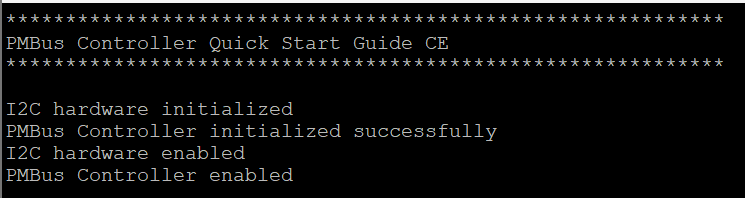
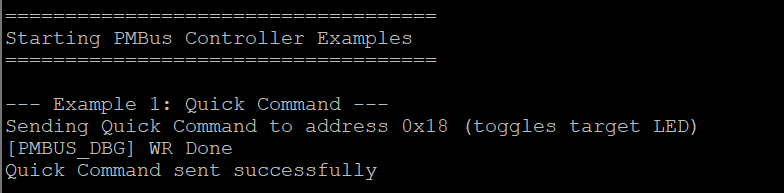
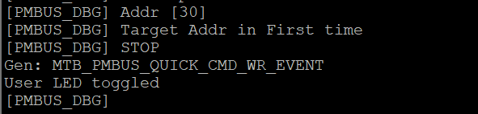
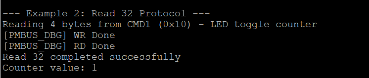
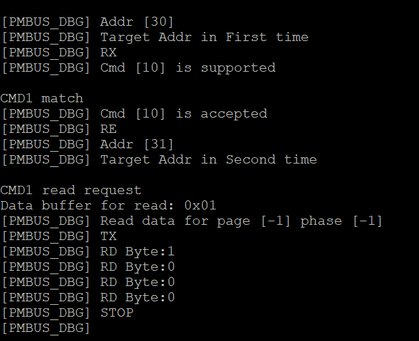
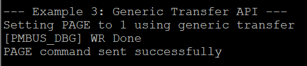
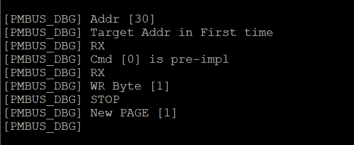
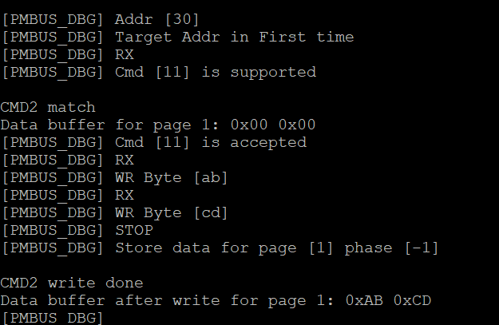
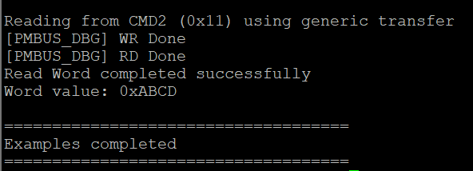
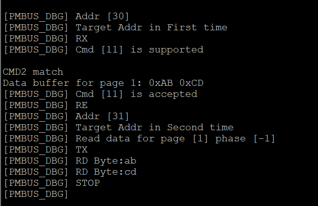

# Verify Controller Mode Workability

This section describes how to verify that the PMBus controller device is working correctly.

## Build and Program

1. Build and program your project.
2. Open a terminal application (e.g., PuTTY, Tera Term) and connect to the device COM port.
3. Check if the I2C transport is initialized correctly and the controller is ready.

4. Connect the PMBus target device (address 0x18) to the I2C bus.
5. Reset the controller device to start the tests.

## Quick Command protocol test

1. The controller will automatically send Quick Command to the target device (address 0x18).
2. Observe the User LED toggle on the target device.
3. Check the terminal output for the transfer completion status.
   - Controller terminal output:

   

   - Target terminal output:

   

## Read 32 protocol test

1. The controller will read 4 bytes from CMD1 (0x10) on the target device.
2. This command reads the LED toggle counter value.
3. Observe the terminal output showing the read data and counter value.
   - Controller terminal output:

   

   - Target terminal output:

   

## Generic transfer examples test

1. The controller will send PAGE command (0x00) with page number (0x01) using generic transfer API.
   - Controller terminal output:

   

   - Target terminal output:

   

2. The controller will write 0xABCD to CMD2 (0x11) using Write Word protocol.
   - Controller terminal output:

   

   - Target terminal output:

   

3. The controller will read data from CMD2 (0x11) using Read Word protocol.
   - Controller terminal output:

   

   - Target terminal output:

   

4. Observe the terminal output showing all transfer results.

