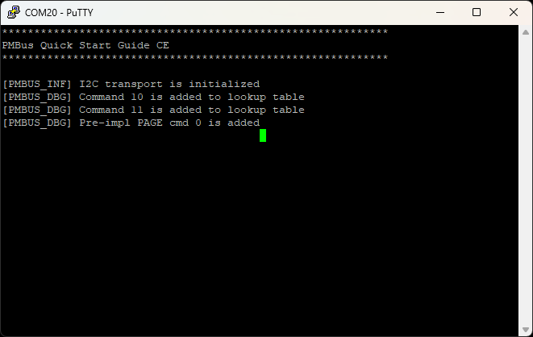
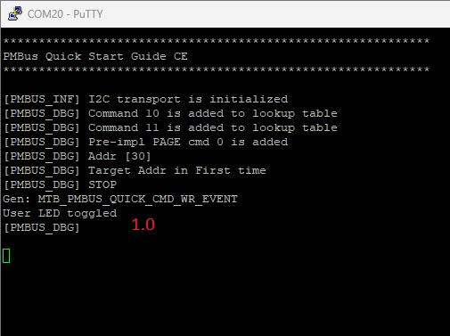
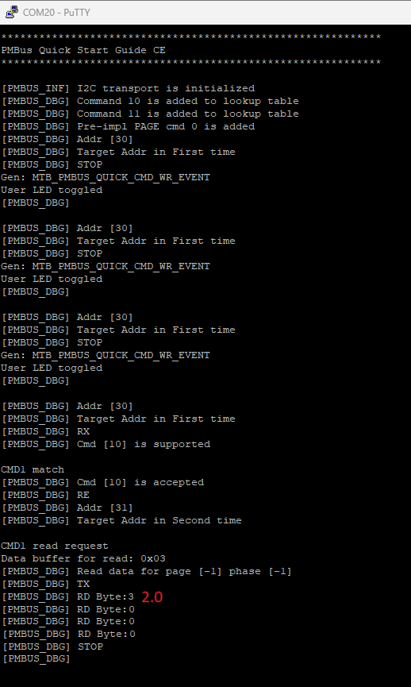
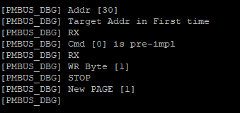
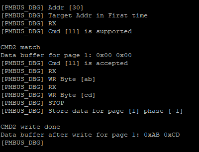
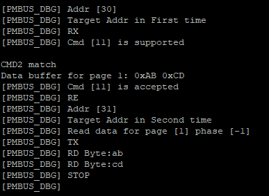

# Verify Target Mode Workability

This section describes how to verify that the SMBus/PMBus target device is working correctly.

## Build and Program

1. Build and program your project.
2. Open a terminal application (e.g., PuTTY, Tera Term) and connect to the device COM port.
3. Check if I2C transport is initialized correctly and all commands are registered.

4. Connect the I2C Controller to the device.

## Quick Command and Read 32 protocols test (SMBus/PMBus mode)

1. Send Quick Command with the write direction to the device address (The User LED will toggle (#1.0)).

2. Repeat the previous step with Quick Command several more times.
3. Send Read 32 protocol with CMD1 command code (0x10) to the device address (the Controller will read User LED toggle counter (#2.0)).

## PAGE command and Write/Read Word protocols with page support test (PMBus mode only)

1. Send Write Byte to the device address with PAGE command code (0x00) and page number (0x01) (Target will switch to page 1).

2. Send Write Word to the device address with CMD2 command code (0x11) and data bytes (0xAB 0xCD) (Target will write command data buffer on page 1).

3. Send Read Word to the device address with CMD2 command code (Controller will read data from command data buffer on page 1).

